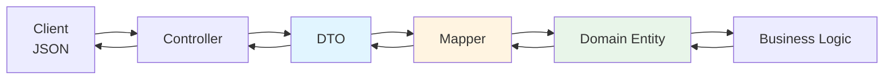
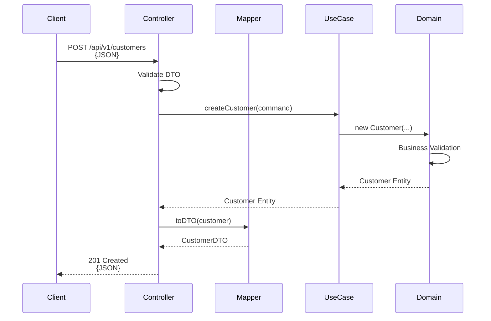
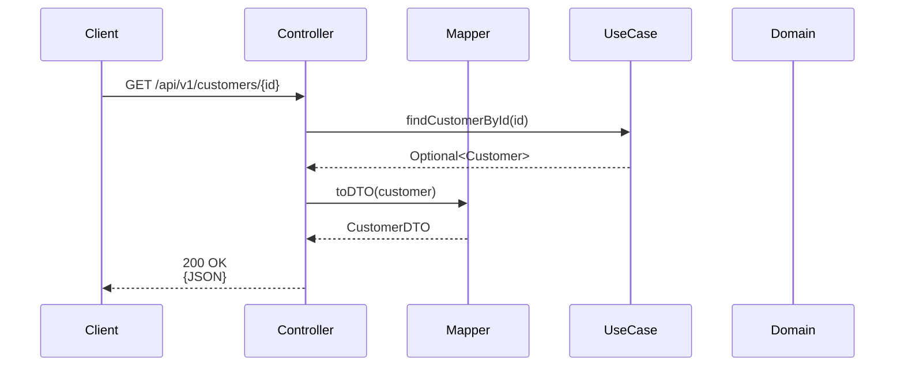

# 🎨 Guia do Padrão DTO (Data Transfer Object)

## 📋 Visão Geral

Este projeto utiliza o **padrão DTO** para manter o domínio puro e isolado de preocupações de serialização/deserialização. Os DTOs são usados exclusivamente na camada de apresentação (Controllers) para comunicação com clientes externos.

## 🎯 Objetivos

1. **Domínio Puro**: Manter entidades de domínio livres de anotações de frameworks
2. **Separação de Concerns**: Isolar lógica de serialização da lógica de negócio
3. **Flexibilidade**: Facilitar mudanças no formato de API sem afetar o domínio
4. **Testabilidade**: Permitir testes unitários do domínio sem dependências externas

## 🏗️ Arquitetura



## 📁 Estrutura de Arquivos

```
spring-boot-app/
├── dto/
│   ├── CustomerDTO.java           ← DTOs com anotações Jackson
│   ├── MenuItemDTO.java
│   ├── OrderDTO.java
│   └── RestaurantTableDTO.java
├── mapper/
│   ├── CustomerDTOMapper.java     ← Conversores Domain ↔ DTO
│   ├── MenuItemDTOMapper.java
│   ├── OrderDTOMapper.java
│   └── RestaurantTableDTOMapper.java
└── controller/
    ├── CustomerController.java    ← Usa DTOs nas APIs
    ├── MenuItemController.java
    ├── OrderController.java
    └── TableController.java
```

## 🔄 Fluxo de Dados

### Criação de Entidade (POST)



### Consulta de Entidade (GET)



## 📝 Exemplo Completo: Customer

### 1. DTO (Camada de Apresentação)

```java
package com.restaurant.springboot.dto;

import com.fasterxml.jackson.annotation.JsonFormat;
import jakarta.validation.constraints.Email;
import jakarta.validation.constraints.NotBlank;

import java.time.LocalDateTime;
import java.util.UUID;

/**
 * DTO for Customer entity - used for REST API serialization
 */
public class CustomerDTO {
    
    private UUID id;
    
    @NotBlank(message = "Name is required")
    private String name;
    
    @Email(message = "Email must be valid")
    private String email;
    
    @JsonFormat(shape = JsonFormat.Shape.STRING, pattern = "yyyy-MM-dd'T'HH:mm:ss")
    private LocalDateTime createdAt;
    
    // Constructors, Getters, Setters...
}
```

### 2. Mapper (Conversão)

```java
package com.restaurant.springboot.mapper;

import com.restaurant.domain.entity.Customer;
import com.restaurant.springboot.dto.CustomerDTO;
import org.springframework.stereotype.Component;

@Component
public class CustomerDTOMapper {
    
    public CustomerDTO toDTO(Customer customer) {
        if (customer == null) return null;
        
        return new CustomerDTO(
            customer.getId(),
            customer.getName(),
            customer.getEmail(),
            customer.getPhone(),
            customer.getAddress(),
            customer.getCreatedAt(),
            customer.getUpdatedAt(),
            customer.isActive()
        );
    }
    
    public Customer toDomain(CustomerDTO dto) {
        if (dto == null) return null;
        
        Customer customer = new Customer(
            dto.getName(),
            dto.getEmail(),
            dto.getPhone(),
            dto.getAddress()
        );
        
        if (dto.getId() != null) {
            customer.setId(dto.getId());
        }
        
        return customer;
    }
}
```

### 3. Controller (Uso)

```java
package com.restaurant.springboot.controller;

import com.restaurant.application.port.in.CustomerUseCase;
import com.restaurant.domain.entity.Customer;
import com.restaurant.springboot.dto.CustomerDTO;
import com.restaurant.springboot.mapper.CustomerDTOMapper;
import org.springframework.beans.factory.annotation.Autowired;
import org.springframework.http.ResponseEntity;
import org.springframework.web.bind.annotation.*;

import java.util.List;
import java.util.stream.Collectors;

@RestController
@RequestMapping("/api/v1/customers")
public class CustomerController {
    
    @Autowired
    private CustomerUseCase customerUseCase;
    
    @Autowired
    private CustomerDTOMapper customerMapper;
    
    @PostMapping
    public ResponseEntity<CustomerDTO> createCustomer(@RequestBody CreateCustomerRequest request) {
        CustomerUseCase.CreateCustomerCommand command = new CustomerUseCase.CreateCustomerCommand(
            request.name(), request.email(), request.phone(), request.address()
        );
        
        Customer customer = customerUseCase.createCustomer(command);
        CustomerDTO dto = customerMapper.toDTO(customer);
        
        return ResponseEntity.status(201).body(dto);
    }
    
    @GetMapping
    public ResponseEntity<List<CustomerDTO>> getAllCustomers() {
        List<Customer> customers = customerUseCase.getAllActiveCustomers();
        List<CustomerDTO> dtos = customers.stream()
            .map(customerMapper::toDTO)
            .collect(Collectors.toList());
        
        return ResponseEntity.ok(dtos);
    }
    
    @GetMapping("/{id}")
    public ResponseEntity<CustomerDTO> getCustomerById(@PathVariable UUID id) {
        return customerUseCase.findCustomerById(id)
            .map(customerMapper::toDTO)
            .map(ResponseEntity::ok)
            .orElse(ResponseEntity.notFound().build());
    }
}
```

### 4. Domain Entity (Puro)

```java
package com.restaurant.domain.entity;

import java.time.LocalDateTime;
import java.util.UUID;

/**
 * Customer domain entity - PURE JAVA, NO FRAMEWORK ANNOTATIONS
 */
public class Customer {
    
    private UUID id;
    private String name;
    private String email;
    private String phone;
    private String address;
    private LocalDateTime createdAt;
    private LocalDateTime updatedAt;
    private boolean active;
    
    // Business Logic
    public void activate() {
        this.active = true;
        this.updatedAt = LocalDateTime.now();
    }
    
    public void deactivate() {
        this.active = false;
        this.updatedAt = LocalDateTime.now();
    }
    
    // Constructors, Getters, Setters...
}
```

## ✅ Checklist para Adicionar Novo DTO

### Passo 1: Criar DTO
- [ ] Criar classe DTO em `spring-boot-app/src/main/java/com/restaurant/springboot/dto/`
- [ ] Adicionar anotações Jackson (`@JsonFormat`, etc.)
- [ ] Adicionar validações Jakarta (`@NotNull`, `@Email`, etc.)
- [ ] Implementar construtores, getters e setters

### Passo 2: Criar Mapper
- [ ] Criar classe Mapper em `spring-boot-app/src/main/java/com/restaurant/springboot/mapper/`
- [ ] Anotar com `@Component`
- [ ] Implementar método `toDTO(Entity entity)`
- [ ] Implementar método `toDomain(DTO dto)` (se necessário)

### Passo 3: Atualizar Controller
- [ ] Injetar o Mapper no Controller
- [ ] Substituir retornos de `Entity` por `DTO`
- [ ] Converter entidades para DTOs usando `mapper.toDTO()`
- [ ] Converter listas usando `stream().map(mapper::toDTO).collect()`

### Passo 4: Testar
- [ ] Compilar o projeto: `mvn clean compile`
- [ ] Executar testes de arquitetura: `mvn test -pl architecture-tests`
- [ ] Testar endpoints manualmente ou com testes de integração

## 🎨 Padrões e Convenções

### Nomenclatura
- **DTO**: `<Entity>DTO.java` (ex: `CustomerDTO.java`)
- **Mapper**: `<Entity>DTOMapper.java` (ex: `CustomerDTOMapper.java`)
- **Métodos**: `toDTO()`, `toDomain()`

### Anotações Comuns

#### Jackson (Serialização JSON)
```java
@JsonFormat(shape = JsonFormat.Shape.STRING, pattern = "yyyy-MM-dd'T'HH:mm:ss")
private LocalDateTime createdAt;

@JsonProperty("customer_name")  // Renomear campo no JSON
private String name;

@JsonIgnore  // Não serializar
private String internalField;
```

#### Jakarta Validation
```java
@NotNull(message = "Field is required")
@NotBlank(message = "Field cannot be blank")
@Email(message = "Must be a valid email")
@Size(min = 2, max = 100, message = "Size must be between 2 and 100")
@Min(value = 1, message = "Must be at least 1")
@DecimalMin(value = "0.0", message = "Must be non-negative")
```

## 🚫 O Que NÃO Fazer

### ❌ NÃO adicione anotações Jackson no Domínio
```java
// ❌ ERRADO - Domínio com anotações de framework
package com.restaurant.domain.entity;

import com.fasterxml.jackson.annotation.JsonFormat;  // ❌

public class Customer {
    @JsonFormat(...)  // ❌ NÃO FAÇA ISSO!
    private LocalDateTime createdAt;
}
```

### ❌ NÃO exponha entidades de domínio diretamente
```java
// ❌ ERRADO - Retornando entidade de domínio
@GetMapping("/{id}")
public ResponseEntity<Customer> getCustomer(@PathVariable UUID id) {
    return ResponseEntity.ok(customerUseCase.findById(id));  // ❌
}
```

### ✅ FAÇA assim
```java
// ✅ CORRETO - Retornando DTO
@GetMapping("/{id}")
public ResponseEntity<CustomerDTO> getCustomer(@PathVariable UUID id) {
    return customerUseCase.findById(id)
        .map(customerMapper::toDTO)  // ✅ Converte para DTO
        .map(ResponseEntity::ok)
        .orElse(ResponseEntity.notFound().build());
}
```

## 📊 DTOs Implementados

| Entidade | DTO | Mapper | Controller | Status |
|----------|-----|--------|------------|--------|
| Customer | ✅ | ✅ | ✅ | Completo |
| MenuItem | ✅ | ✅ | ✅ | Completo |
| Order | ✅ | ✅ | ⏳ | Pendente |
| RestaurantTable | ✅ | ✅ | ⏳ | Pendente |

## 🔗 Recursos Relacionados

- [ARCHITECTURE_DIAGRAMS.md](./ARCHITECTURE_DIAGRAMS.md) - Diagramas visuais da arquitetura
- [ARCHITECTURE.md](./ARCHITECTURE.md) - Documentação completa da arquitetura
- [IMPLEMENTATION_SUMMARY.md](./IMPLEMENTATION_SUMMARY.md) - Resumo da implementação

## 💡 Dicas

1. **Sempre use Mappers**: Nunca faça conversão manual no Controller
2. **DTOs são imutáveis**: Prefira records ou classes com final fields
3. **Validação no DTO**: Use Jakarta Validation para validar entrada
4. **Documentação**: Use Swagger/OpenAPI para documentar DTOs
5. **Testes**: Teste os Mappers separadamente dos Controllers

## 🎓 Benefícios Alcançados

- ✅ **Domínio 100% puro**: Sem dependências de frameworks
- ✅ **Flexibilidade**: Fácil mudar formato de API
- ✅ **Testabilidade**: Domínio testável sem mocks complexos
- ✅ **Manutenibilidade**: Mudanças isoladas por camada
- ✅ **Validação Automática**: Testes de arquitetura garantem pureza

---

**Última atualização**: 2025-09-30  
**Versão**: 1.0.0
