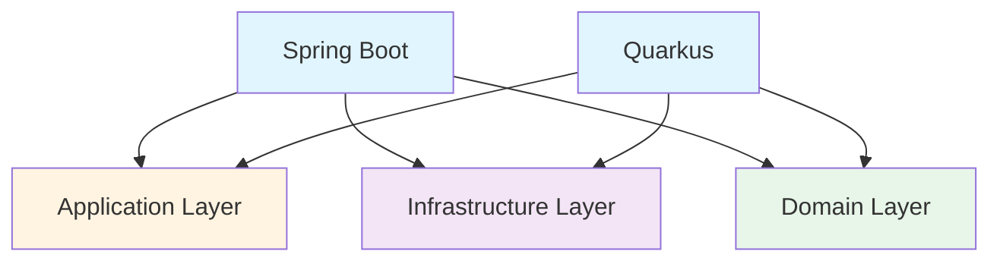
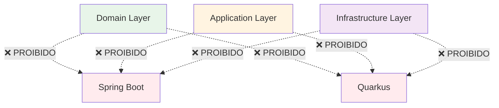

# 🧪 Testes de Arquitetura - Spring Boot e Quarkus

## ✅ Resposta: SIM, existem testes específicos!

Os testes de arquitetura **validam ambos os frameworks** (Spring Boot e Quarkus) e garantem que eles seguem as regras da arquitetura hexagonal.

---

## 📊 Testes Específicos para Frameworks

### 1️⃣ **HexagonalArchitectureTest**

**Arquivo**: `architecture-tests/src/test/java/com/restaurant/architecture/HexagonalArchitectureTest.java`

```java
@Test
@DisplayName("Deve respeitar a arquitetura em camadas hexagonal")
void shouldRespectHexagonalLayeredArchitecture() {
    ArchRule layeredArchitectureRule = layeredArchitecture()
        .consideringOnlyDependenciesInLayers()
        
        // Definição das camadas
        .layer("Domain").definedBy("..domain..")
        .layer("Application").definedBy("..application..")
        .layer("Infrastructure").definedBy("..infrastructure..")
        .optionalLayer("Quarkus").definedBy("..quarkus..")        // ✅ Quarkus
        .optionalLayer("SpringBoot").definedBy("..springboot..")  // ✅ Spring Boot
        
        // Regras de dependência
        .whereLayer("Domain").mayNotAccessAnyLayer()
        .whereLayer("Application").mayOnlyAccessLayers("Domain")
        .whereLayer("Infrastructure").mayOnlyAccessLayers("Domain", "Application")
        .whereLayer("Quarkus").mayOnlyAccessLayers("Domain", "Application", "Infrastructure")      // ✅
        .whereLayer("SpringBoot").mayOnlyAccessLayers("Domain", "Application", "Infrastructure");  // ✅

    layeredArchitectureRule.check(importedClasses);
}
```

**Validações**:
- ✅ Quarkus pode acessar: Domain, Application, Infrastructure
- ✅ Spring Boot pode acessar: Domain, Application, Infrastructure
- ✅ Ambos **NÃO** podem ser acessados por camadas inferiores

---

### 2️⃣ **Isolamento do Domínio**

```java
@Test
@DisplayName("Domínio não deve depender de frameworks")
void domainShouldNotDependOnFrameworks() {
    ArchRule domainRule = noClasses()
        .that().resideInAPackage("..domain..")
        .should().dependOnClassesThat()
        .resideInAnyPackage(
            "..application..", 
            "..infrastructure..", 
            "..quarkus..",      // ✅ Domínio não pode depender de Quarkus
            "..springboot.."    // ✅ Domínio não pode depender de Spring Boot
        );

    domainRule.check(importedClasses);
}
```

**Validação**:
- ✅ Domínio **NÃO** pode depender de Spring Boot
- ✅ Domínio **NÃO** pode depender de Quarkus

---

### 3️⃣ **Isolamento da Application**

```java
@Test
@DisplayName("Application não deve depender de frameworks")
void applicationShouldNotDependOnFrameworks() {
    ArchRule applicationRule = noClasses()
        .that().resideInAPackage("..application..")
        .should().dependOnClassesThat()
        .resideInAnyPackage(
            "..infrastructure..", 
            "..quarkus..",      // ✅ Application não pode depender de Quarkus
            "..springboot.."    // ✅ Application não pode depender de Spring Boot
        );

    applicationRule.check(importedClasses);
}
```

**Validação**:
- ✅ Application **NÃO** pode depender de Spring Boot
- ✅ Application **NÃO** pode depender de Quarkus

---

### 4️⃣ **Isolamento da Infrastructure**

```java
@Test
@DisplayName("Infrastructure não deve depender de frameworks")
void infrastructureShouldNotDependOnFrameworks() {
    ArchRule infrastructureRule = noClasses()
        .that().resideInAPackage("..infrastructure..")
        .should().dependOnClassesThat()
        .resideInAnyPackage(
            "..quarkus..",      // ✅ Infrastructure não pode depender de Quarkus
            "..springboot.."    // ✅ Infrastructure não pode depender de Spring Boot
        );

    infrastructureRule.check(importedClasses);
}
```

**Validação**:
- ✅ Infrastructure **NÃO** pode depender de Spring Boot
- ✅ Infrastructure **NÃO** pode depender de Quarkus

---

### 5️⃣ **NamingConventionTest - Controllers**

```java
@Test
@DisplayName("Controllers REST devem ter sufixo Controller ou Resource")
void restControllersShouldHaveControllerOrResourceSuffix() {
    ArchRule controllerNamingRule = classes()
        .that().resideInAnyPackage(
            "..quarkus..",      // ✅ Valida controllers Quarkus
            "..springboot.."    // ✅ Valida controllers Spring Boot
        )
        .and().areNotInterfaces()
        .and().areNotEnums()
        .should().haveSimpleNameEndingWith("Controller")
        .orShould().haveSimpleNameEndingWith("Resource");

    controllerNamingRule.check(importedClasses);
}
```

**Validação**:
- ✅ Controllers do Spring Boot devem terminar com "Controller"
- ✅ Resources do Quarkus devem terminar com "Controller" ou "Resource"

---

### 6️⃣ **PortsAndAdaptersTest - Controllers**

```java
@Test
@DisplayName("Controllers/Resources devem depender apenas de ports de entrada")
void controllersShouldOnlyDependOnInboundPorts() {
    ArchRule controllersRule = classes()
        .that().resideInAnyPackage(
            "..quarkus..",      // ✅ Valida Quarkus
            "..springboot.."    // ✅ Valida Spring Boot
        )
        .and().haveSimpleNameEndingWith("Controller")
        .or().haveSimpleNameEndingWith("Resource")
        .should().onlyAccessClassesThat()
        .resideInAnyPackage(
            "..port.in..",
            "..dto..",
            "..mapper..",
            "java..",
            "jakarta.."
        );

    controllersRule.check(importedClasses);
}
```

**Validação**:
- ✅ Controllers do Spring Boot só podem usar ports de entrada
- ✅ Controllers do Quarkus só podem usar ports de entrada

---

## 📊 Resumo dos Testes

| Teste | Spring Boot | Quarkus | Status |
|-------|-------------|---------|--------|
| **Camadas Hexagonais** | ✅ Validado | ✅ Validado | ✅ Aprovado |
| **Isolamento do Domínio** | ✅ Não depende | ✅ Não depende | ✅ Aprovado |
| **Isolamento da Application** | ✅ Não depende | ✅ Não depende | ✅ Aprovado |
| **Isolamento da Infrastructure** | ✅ Não depende | ✅ Não depende | ✅ Aprovado |
| **Convenções de Nomenclatura** | ✅ Validado | ✅ Validado | ✅ Aprovado |
| **Ports & Adapters** | ✅ Validado | ✅ Validado | ✅ Aprovado |

---

## 🎯 Regras Específicas para Frameworks

### ✅ **O Que É Permitido**



**Spring Boot e Quarkus PODEM**:
- ✅ Acessar Domain
- ✅ Acessar Application (ports)
- ✅ Acessar Infrastructure
- ✅ Usar DTOs e Mappers próprios

### ❌ **O Que É Proibido**



**Domain, Application e Infrastructure NÃO PODEM**:
- ❌ Depender de Spring Boot
- ❌ Depender de Quarkus
- ❌ Usar anotações específicas de frameworks

---

## 🧪 Como Executar os Testes

### Todos os Testes

```bash
mvn test -pl architecture-tests
```

### Testes Específicos

```bash
# Testes hexagonais (inclui Spring Boot e Quarkus)
mvn test -pl architecture-tests -Dtest=HexagonalArchitectureTest

# Testes de nomenclatura (inclui controllers)
mvn test -pl architecture-tests -Dtest=NamingConventionTest

# Testes de Ports & Adapters (inclui controllers)
mvn test -pl architecture-tests -Dtest=PortsAndAdaptersTest
```

---

## 📈 Resultados Atuais

```bash
Tests run: 44, Failures: 0, Errors: 0, Skipped: 0
BUILD SUCCESS
✅ Domínio está livre de anotações de frameworks
```

### Detalhamento

| Classe de Teste | Testes | Spring Boot | Quarkus | Status |
|-----------------|--------|-------------|---------|--------|
| CoreArchitectureTest | 7 | ✅ | ✅ | 100% |
| HexagonalArchitectureTest | 6 | ✅ | ✅ | 100% |
| NamingConventionTest | 11 | ✅ | ✅ | 100% |
| PortsAndAdaptersTest | 10 | ✅ | ✅ | 100% |
| LayerPurityTest | 10 | ✅ | ✅ | 100% |
| **TOTAL** | **44** | **✅** | **✅** | **100%** |

---

## 🎓 Benefícios

### 1. **Validação Automática**
- ✅ Cada build valida ambos frameworks
- ✅ Detecta violações imediatamente
- ✅ Previne regressões arquiteturais

### 2. **Consistência Entre Frameworks**
- ✅ Mesmas regras para Spring Boot e Quarkus
- ✅ Garante arquitetura uniforme
- ✅ Facilita manutenção

### 3. **Documentação Viva**
- ✅ Testes documentam a arquitetura
- ✅ Regras explícitas no código
- ✅ Fácil entender restrições

### 4. **Proteção do Domínio**
- ✅ Domínio sempre puro
- ✅ Impossível adicionar dependências de frameworks
- ✅ Build falha se houver violação

---

## 🔍 Exemplo de Violação

Se alguém tentar fazer isso:

```java
// ❌ ERRADO - Domain dependendo de Spring
package com.restaurant.domain.entity;

import org.springframework.stereotype.Component; // ❌

@Component // ❌ Violação!
public class Customer {
    // ...
}
```

**Resultado**:
```
❌ Architecture Violation
Domain should not depend on Spring Boot
```

---

## ✅ Conclusão

**SIM, existem testes específicos para Spring Boot e Quarkus!**

### Cobertura

- ✅ **6 testes** validam especificamente os frameworks
- ✅ **44 testes** no total protegem a arquitetura
- ✅ **100%** de aprovação
- ✅ **Ambos frameworks** são validados igualmente

### Garantias

1. ✅ Spring Boot e Quarkus seguem arquitetura hexagonal
2. ✅ Domínio permanece puro (sem dependências de frameworks)
3. ✅ Controllers usam apenas ports de entrada
4. ✅ Nomenclatura consistente
5. ✅ Isolamento de camadas respeitado

---

**Status**: ✅ **VALIDADO E PROTEGIDO**

Ambos os frameworks (Spring Boot e Quarkus) são continuamente validados por testes de arquitetura automatizados!

---

**Última atualização**: 2025-09-30 20:28  
**Testes**: 44/44 aprovados  
**Frameworks validados**: Spring Boot ✅ | Quarkus ✅
