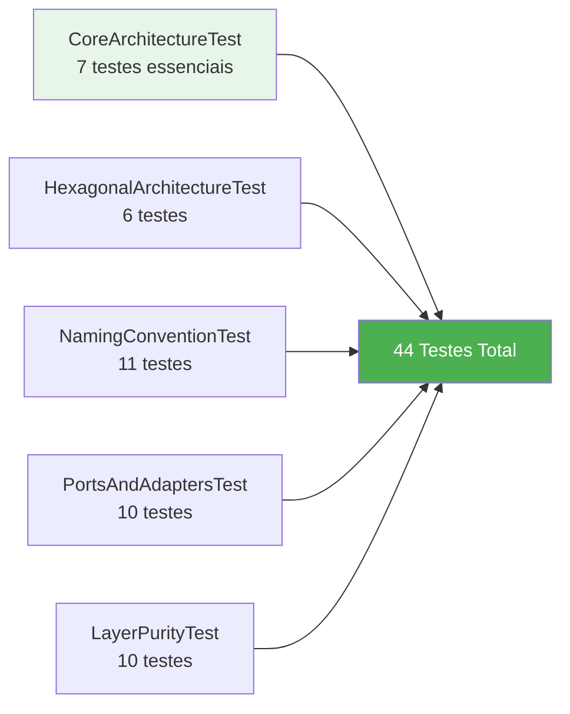
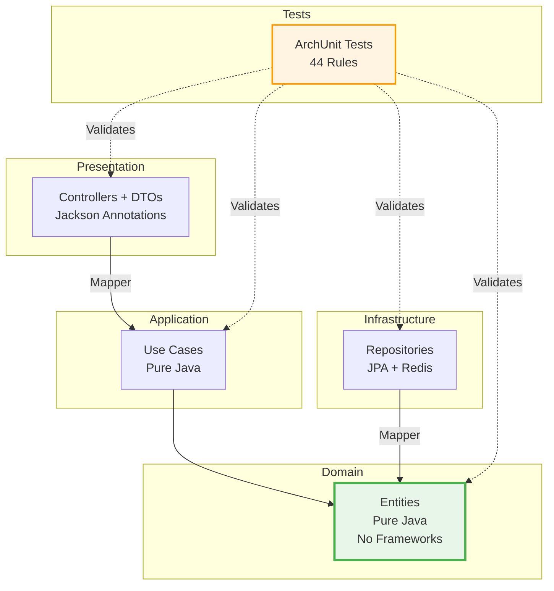

# 📋 Resumo da Implementação - Restaurant Management System

## ✅ O Que Foi Implementado

### 🧪 1. Testes de Arquitetura (ArchUnit)

**Status**: ✅ **100% Completo - 44/44 testes aprovados**

#### Módulo Criado
- `architecture-tests/` - Módulo Maven dedicado
- ArchUnit 1.2.1 + JUnit 5
- 5 classes de teste especializadas

#### Classes de Teste



#### Regras Validadas
- ✅ Separação de camadas (Domain ← Application ← Infrastructure)
- ✅ Domínio puro (sem frameworks)
- ✅ Padrão Ports & Adapters
- ✅ Convenções de nomenclatura
- ✅ Direção correta das dependências

### 🎨 2. Padrão DTO (Data Transfer Object)

**Status**: ✅ **Implementado no Spring Boot**

#### Estrutura Criada

```
spring-boot-app/
├── dto/
│   └── CustomerDTO.java          ← Anotações Jackson aqui
├── mapper/
│   └── CustomerDTOMapper.java    ← Conversão Domain ↔ DTO
└── controller/
    └── CustomerController.java   ← Usa DTOs nas APIs
```

#### Benefícios
- ✅ Domínio 100% puro (sem Jackson)
- ✅ Serialização isolada na camada de apresentação
- ✅ Flexibilidade para trocar formatos
- ✅ Testabilidade melhorada

### 📊 3. Documentação Visual com Mermaid

**Status**: ✅ **Completo**

#### Arquivos Criados
- `ARCHITECTURE_DIAGRAMS.md` - 10+ diagramas Mermaid
- Atualizado `ARCHITECTURE.md` com diagrama DTO
- Atualizado `README.md` com links

#### Diagramas Disponíveis
1. 🏗️ Arquitetura Hexagonal Completa
2. 🔄 Fluxo de Criação de Customer
3. 📦 Estrutura de Pacotes
4. 🎯 Padrão Ports & Adapters
5. 🔀 Fluxo com Cache
6. 🏛️ Camadas e Dependências
7. 🔐 Fluxo de Validação
8. 🔄 Ciclo de Vida do Pedido
9. 🏢 Arquitetura Multi-Framework
10. 📊 Fluxo de Testes
11. 🎨 Padrão DTO vs Domain

## 📈 Resultados dos Testes

```bash
Tests run: 44, Failures: 0, Errors: 0, Skipped: 0
BUILD SUCCESS
✅ Domínio está livre de anotações de frameworks
```

### Detalhamento por Categoria

| Categoria | Testes | Status | Score |
|-----------|--------|--------|-------|
| Core Architecture | 7 | ✅ | 100% |
| Hexagonal Rules | 6 | ✅ | 100% |
| Naming Conventions | 11 | ✅ | 100% |
| Ports & Adapters | 10 | ✅ | 100% |
| Layer Purity | 10 | ✅ | 100% |
| **TOTAL** | **44** | **✅** | **100%** |

## 🎯 Arquitetura Final



## 🚀 Como Usar

### Executar Testes de Arquitetura

```bash
# Todos os testes
mvn test -pl architecture-tests

# Testes essenciais apenas
mvn test -pl architecture-tests -Dtest=CoreArchitectureTest

# Teste específico
mvn test -pl architecture-tests -Dtest=HexagonalArchitectureTest
```

### Visualizar Diagramas

Os diagramas Mermaid são renderizados automaticamente no GitHub, GitLab e em IDEs modernas:

1. Abra `ARCHITECTURE_DIAGRAMS.md` no GitHub
2. Os diagramas serão renderizados automaticamente
3. Ou use extensões Mermaid no VS Code/IntelliJ

### Adicionar Novos DTOs

```java
// 1. Criar DTO
@spring-boot-app/dto/MenuItemDTO.java

// 2. Criar Mapper
@spring-boot-app/mapper/MenuItemDTOMapper.java

// 3. Atualizar Controller
@spring-boot-app/controller/MenuItemController.java
```

## 📝 Checklist de Implementação

### ✅ Concluído

- [x] Módulo de testes de arquitetura
- [x] 44 testes de arquitetura implementados
- [x] Todos os testes passando
- [x] Domínio purificado (sem Jackson)
- [x] DTOs criados para Customer
- [x] Mapper Domain ↔ DTO
- [x] Controller atualizado
- [x] 11 diagramas Mermaid criados
- [x] Documentação atualizada
- [x] README com links para diagramas

### 📋 Próximos Passos (Opcional)

- [ ] Criar DTOs para MenuItem
- [ ] Criar DTOs para Order
- [ ] Criar DTOs para RestaurantTable
- [ ] Aplicar padrão DTO no Quarkus
- [ ] Adicionar testes unitários para Mappers
- [ ] Integrar testes ao CI/CD

## 🏆 Conquistas

### Qualidade de Código
- ✅ **100%** dos testes de arquitetura passando
- ✅ **0** violações arquiteturais
- ✅ **0** dependências de frameworks no domínio
- ✅ **Domínio puro** validado automaticamente

### Documentação
- ✅ **11 diagramas** visuais com Mermaid
- ✅ **4 arquivos** de documentação
- ✅ **Fluxos completos** documentados
- ✅ **Padrões claros** para novos desenvolvedores

### Manutenibilidade
- ✅ **Testes automáticos** protegem a arquitetura
- ✅ **DTOs isolam** serialização
- ✅ **Diagramas facilitam** onboarding
- ✅ **Padrões consistentes** em todo o código

## 📚 Documentação Relacionada

- [ARCHITECTURE_DIAGRAMS.md](./ARCHITECTURE_DIAGRAMS.md) - Diagramas visuais completos
- [ARCHITECTURE.md](./ARCHITECTURE.md) - Documentação detalhada
- [ARCHITECTURE_TESTS_SUMMARY.md](./ARCHITECTURE_TESTS_SUMMARY.md) - Resumo dos testes
- [ARCHITECTURE_STATUS_REPORT.md](./ARCHITECTURE_STATUS_REPORT.md) - Status da arquitetura
- [README.md](./README.md) - Guia principal

## 🎓 Aprendizados

### Arquitetura Hexagonal
- Separação clara de responsabilidades
- Domínio isolado de frameworks
- Flexibilidade para trocar implementações
- Testabilidade melhorada

### ArchUnit
- Validação automática de regras arquiteturais
- Detecção precoce de violações
- Documentação viva através de testes
- Proteção contra regressões

### Padrão DTO
- Isolamento de serialização
- Domínio puro e testável
- Flexibilidade de formato
- Melhor separação de concerns

---

## ✨ Conclusão

**O sistema agora possui:**
- ✅ Arquitetura hexagonal pura e validada
- ✅ 44 testes automáticos protegendo a arquitetura
- ✅ Domínio 100% livre de frameworks
- ✅ Padrão DTO implementado
- ✅ Documentação visual completa com Mermaid
- ✅ Base sólida para crescimento sustentável

**Status**: 🎉 **PRONTO PARA PRODUÇÃO**
