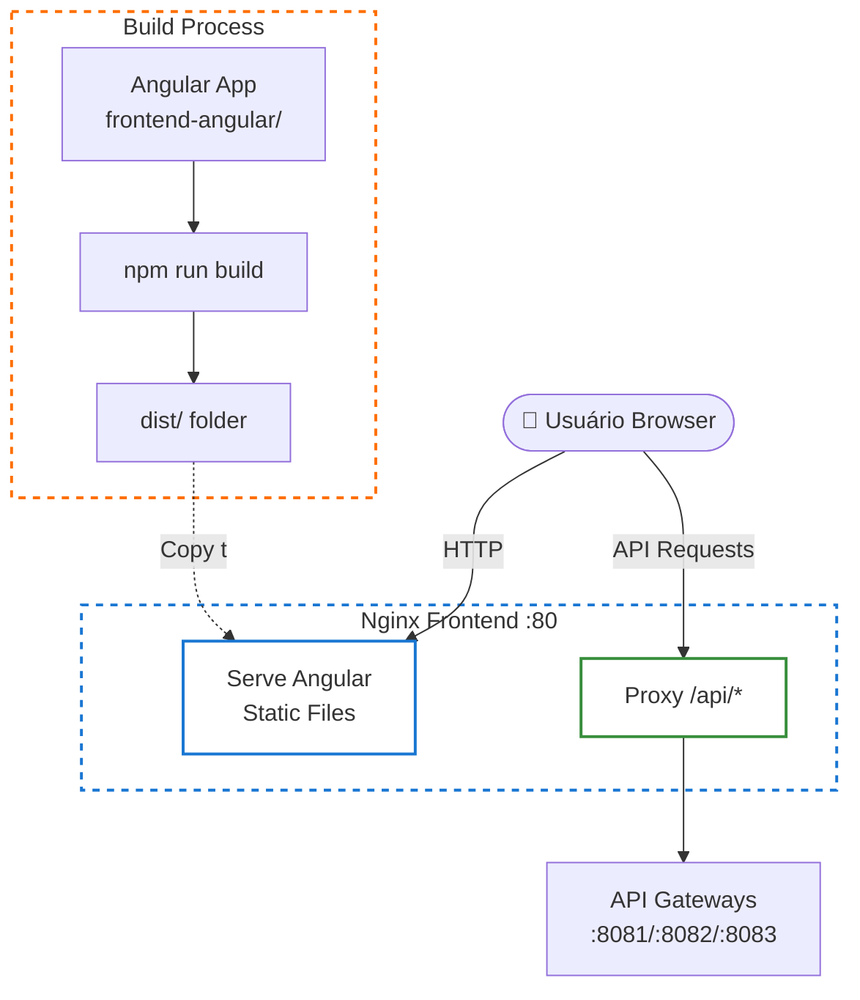

# 🎨 Frontend Infrastructure

Documentação completa para o frontend Angular servido via Nginx.

## 🏗️ Arquitetura



## ⚠️ Status Atual

**O frontend está PARCIALMENTE incluído** - Você precisa fazer o build primeiro!

## 🔧 Como Funciona

O Nginx Frontend serve arquivos estáticos do Angular de:
```
docker-infrastructure/frontend/dist/
```

## 🚀 Opções de Setup

### Opção 1: Build Manual (Recomendado para desenvolvimento)

```bash
# 1. Build do frontend
cd docker-infrastructure
./build-frontend.sh

# 2. Inicie a infraestrutura
./start-all.sh
```

### Opção 2: Build Direto no Frontend

```bash
# 1. Build na pasta do frontend
cd frontend-angular
npm install
npm run build --prod

# 2. Copiar manualmente
cp -r dist/* ../docker-infrastructure/frontend/dist/

# 3. Inicie a infraestrutura
cd ../docker-infrastructure
./start-all.sh
```

### Opção 3: Frontend como Serviço Docker (Avançado)

```bash
# Usar o docker-compose.frontend.yml
docker-compose -f docker-compose.yml \
               -f docker-compose.frontend.yml \
               -f docker-compose.spring.yml \
               up -d
```

## 📁 Estrutura Esperada

```
docker-infrastructure/
└── frontend/
    ├── dist/               # Build do Angular (gerado)
    │   ├── index.html
    │   ├── main.*.js
    │   ├── styles.*.css
    │   └── assets/
    └── Dockerfile          # Para build automatizado (opcional)
```

## ✅ Verificar se Frontend Está Configurado

```bash
# Verificar se a pasta dist existe e tem conteúdo
ls -la frontend/dist/

# Deve mostrar arquivos como:
# index.html, main.js, styles.css, etc.
```

## 🌐 Acesso

Após iniciar a infraestrutura:

- **URL**: http://localhost
- **Porta**: 80 (Nginx)

## 🔄 Atualizar Frontend

```bash
# 1. Rebuild
./build-frontend.sh

# 2. Restart nginx
docker-compose restart nginx
```

## ⚠️ Importante

- **Sempre faça o build do frontend antes** de iniciar a infraestrutura
- O Nginx serve arquivos estáticos, não roda `ng serve`
- Para desenvolvimento ativo do frontend, use `ng serve` separadamente
- A pasta `dist/` é gerada pelo build e não deve estar no git

## 🎯 Desenvolvimento Frontend

Para desenvolvimento ativo do Angular:

```bash
# Terminal 1: Backend via Docker
cd docker-infrastructure
./start-spring.sh

# Terminal 2: Frontend dev server
cd frontend-angular
ng serve

# Acesse: http://localhost:4200
```

Neste modo, o frontend usa `ng serve` (porta 4200) e se conecta ao backend via Docker (porta 80/api/...).
