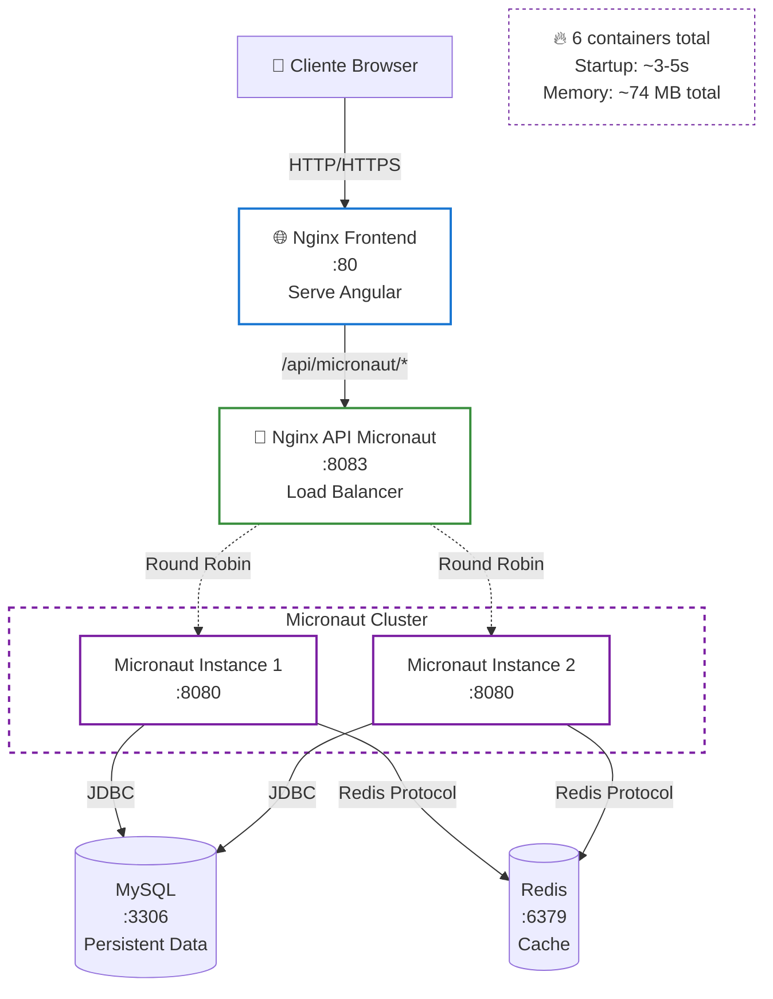

# 🔥 Micronaut Infrastructure

Infraestrutura Docker específica para Micronaut com load balancing e eficiência de recursos.

## 🏗️ Arquitetura



## 📦 Containers

| Container | Porta | Função | Status |
|-----------|-------|--------|--------|
| **nginx-frontend** | 80 | Serve Angular + Proxy | ✅ Ativo |
| **nginx-api-micronaut** | 8083 | Load Balancer | ✅ Ativo |
| **micronaut-app-1** | 8080 | Backend Instance 1 | ✅ Ativo |
| **micronaut-app-2** | 8080 | Backend Instance 2 | ✅ Ativo |
| **mysql** | 3306 | Database | ✅ Ativo |
| **redis** | 6379 | Cache | ✅ Ativo |

**Total**: 6 containers

## 🚀 Como Usar

### Iniciar Infraestrutura

```bash
cd docker-infrastructure
./start-micronaut.sh
```

### Verificar Status

```bash
docker-compose -f docker-compose.yml -f docker-compose.micronaut.yml ps
```

### Ver Logs

```bash
# Todos os containers
docker-compose -f docker-compose.yml -f docker-compose.micronaut.yml logs -f

# Apenas Micronaut
docker logs micronaut-app-1 -f
docker logs micronaut-app-2 -f

# Apenas Nginx API
docker logs restaurant-nginx-api-micronaut -f
```

### Parar Infraestrutura

```bash
docker-compose -f docker-compose.yml -f docker-compose.micronaut.yml down
```

## 🌐 Endpoints

### Via Frontend (Porta 80)

```bash
# Acessar aplicação
http://localhost

# API via proxy
curl http://localhost/api/micronaut/customers
curl http://localhost/api/micronaut/menu-items
```

### Via API Gateway (Porta 8083)

```bash
# Acesso direto ao API Gateway
curl http://localhost:8083/api/customers
curl http://localhost:8083/api/menu-items

# Health check
curl http://localhost:8083/health
```

### Swagger UI

```bash
# Documentação interativa da API
# Arquivos estáticos servidos pelo Micronaut
http://localhost:8083/swagger/restaurant-management-api---micronaut-1.0.0.yml
```

## ⚡ Load Balancing

O Nginx API Gateway distribui requisições entre as 2 instâncias usando **Round Robin**:

```nginx
upstream backend_micronaut {
    server micronaut-app-1:8080;
    server micronaut-app-2:8080;
}
```

### Testar Load Balancing

```bash
# Fazer múltiplas requisições
for i in {1..10}; do
  curl http://localhost:8083/api/customers
  echo "Request $i"
  sleep 1
done

# Ver logs para confirmar distribuição
docker logs restaurant-nginx-api-micronaut
```

## 🔧 Configuração

### Variáveis de Ambiente

```yaml
DATASOURCES_DEFAULT_URL: jdbc:mysql://mysql:3306/restaurant_db
DATASOURCES_DEFAULT_USERNAME: restaurant_user
DATASOURCES_DEFAULT_PASSWORD: restaurant123
REDIS_URI: redis://redis:6379
MICRONAUT_SERVER_PORT: 8080
```

### Tecnologias

| Componente | Tecnologia | Versão |
|------------|------------|--------|
| **Framework** | Micronaut | 4.6.3 |
| **Web Server** | Netty | Embedded |
| **Java** | OpenJDK | 21 |
| **Database** | MySQL | 8.0 |
| **Cache** | Redis | 7-alpine |
| **Proxy** | Nginx | alpine |

## 📊 Performance

### Startup Time

- **Micronaut**: ~3-5s
- **Total Infrastructure**: ~12-18s

### Memory Usage

- **Per Instance**: ~35-45 MB
- **Total (2 instances)**: ~70-90 MB
- **Total Memory Efficiency**: 74 MB total (best in class!)
- **MySQL**: ~400 MB
- **Redis**: ~10 MB
- **Nginx**: ~5 MB cada

**Total Infrastructure**: ~495-515 MB

### Performance Highlights

- 💾 **Best Memory Efficiency**: 74 MB total runtime
- 🚀 **Fast Startup**: ~3-5s
- ⚡ **Low Latency**: Netty async I/O
- 🔥 **Minimal Footprint**: Ideal para microservices
- 📦 **Small JAR**: ~35 MB

## 🧪 Testes

### Health Checks

```bash
# Micronaut Health
curl http://localhost:8083/health

# Nginx health
curl http://localhost:8083/health
```

### Métricas

```bash
# Prometheus metrics (se habilitado)
curl http://localhost:8083/metrics
```

### Teste de Carga

```bash
# Apache Bench
ab -n 1000 -c 10 http://localhost:8083/api/customers

# wrk
wrk -t4 -c100 -d30s http://localhost:8083/api/customers
```

## 🔍 Troubleshooting

### Container não inicia

```bash
# Ver logs de erro
docker logs micronaut-app-1

# Reconstruir imagem
docker-compose -f docker-compose.yml -f docker-compose.micronaut.yml build --no-cache micronaut-app-1
```

### Banco de dados não conecta

```bash
# Verificar MySQL
docker exec -it restaurant-mysql mysql -u restaurant_user -prestaurant123 restaurant_db

# Verificar network
docker network inspect restaurant-network
```

### Load balancing não funciona

```bash
# Verificar configuração Nginx
docker exec restaurant-nginx-api-micronaut cat /etc/nginx/nginx.conf

# Testar conectividade
docker exec restaurant-nginx-api-micronaut ping micronaut-app-1
```

## 📈 Escalabilidade

### Adicionar mais instâncias

Edite `docker-compose.micronaut.yml` e adicione:

```yaml
micronaut-app-3:
  build:
    context: ../backend/micronaut-app
    dockerfile: Dockerfile
  container_name: micronaut-app-3
  # ... mesma configuração
```

Atualize `nginx-api-micronaut.conf`:

```nginx
upstream backend_micronaut {
    server micronaut-app-1:8080;
    server micronaut-app-2:8080;
    server micronaut-app-3:8080;  # Nova instância
}
```

## 🎯 Benefícios

- 💾 **Memory Champion**: Menor consumo de memória
- ⚡ **Fast Startup**: Inicialização rápida
- 🚀 **Netty Power**: I/O assíncrono de alta performance
- 📦 **Small Footprint**: Ideal para containers
- 🔧 **Compile-Time DI**: Injeção de dependência em tempo de compilação
- 🌐 **Cloud Native**: Otimizado para cloud

## 🌟 Micronaut Features

### Modules Utilizados

- `micronaut-data-jdbc`: Data access com JDBC
- `micronaut-redis`: Cliente Redis
- `micronaut-http-server-netty`: Servidor HTTP Netty
- `micronaut-management`: Endpoints de gerenciamento
- `micronaut-openapi`: OpenAPI/Swagger

### Compile-Time DI

Micronaut usa **Ahead-of-Time (AOT) compilation** para:
- ✅ Eliminar reflection em runtime
- ✅ Reduzir uso de memória
- ✅ Acelerar startup
- ✅ Melhorar performance

### GraalVM Native Image

```bash
# Compilar para native image (opcional)
cd backend/micronaut-app
./mvnw package -Dpackaging=native-image
```

## 🔗 Links Úteis

- **[Micronaut Documentation](https://docs.micronaut.io/)**
- **[Micronaut Guides](https://guides.micronaut.io/)**
- **[Netty Documentation](https://netty.io/wiki/)**
- **[Micronaut Data](https://micronaut-projects.github.io/micronaut-data/)**

---

**[⬅️ Voltar para Infraestrutura Principal](../README.md)**
