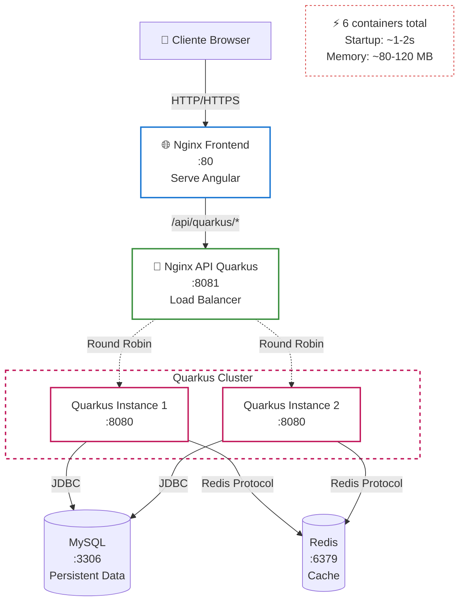

# ⚡ Quarkus Infrastructure

Infraestrutura Docker específica para Quarkus com load balancing e performance otimizada.

## 🏗️ Arquitetura



## 📦 Containers

| Container | Porta | Função | Status |
|-----------|-------|--------|--------|
| **nginx-frontend** | 80 | Serve Angular + Proxy | ✅ Ativo |
| **nginx-api-quarkus** | 8081 | Load Balancer | ✅ Ativo |
| **quarkus-app-1** | 8080 | Backend Instance 1 | ✅ Ativo |
| **quarkus-app-2** | 8080 | Backend Instance 2 | ✅ Ativo |
| **mysql** | 3306 | Database | ✅ Ativo |
| **redis** | 6379 | Cache | ✅ Ativo |

**Total**: 6 containers

## 🚀 Como Usar

### Iniciar Infraestrutura

```bash
cd docker-infrastructure
./start-quarkus.sh
```

### Verificar Status

```bash
docker-compose -f docker-compose.yml -f docker-compose.quarkus.yml ps
```

### Ver Logs

```bash
# Todos os containers
docker-compose -f docker-compose.yml -f docker-compose.quarkus.yml logs -f

# Apenas Quarkus
docker logs quarkus-app-1 -f
docker logs quarkus-app-2 -f

# Apenas Nginx API
docker logs restaurant-nginx-api-quarkus -f
```

### Parar Infraestrutura

```bash
docker-compose -f docker-compose.yml -f docker-compose.quarkus.yml down
```

## 🌐 Endpoints

### Via Frontend (Porta 80)

```bash
# Acessar aplicação
http://localhost

# API via proxy
curl http://localhost/api/quarkus/customers
curl http://localhost/api/quarkus/menu-items
```

### Via API Gateway (Porta 8081)

```bash
# Acesso direto ao API Gateway
curl http://localhost:8081/api/customers
curl http://localhost:8081/api/menu-items

# Health check
curl http://localhost:8081/health
```

### Swagger UI

```bash
# Documentação interativa da API
http://localhost:8081/q/swagger-ui
```

### Dev UI (Quarkus)

```bash
# Interface de desenvolvimento (apenas em dev mode)
http://localhost:8081/q/dev
```

## ⚡ Load Balancing

O Nginx API Gateway distribui requisições entre as 2 instâncias usando **Round Robin**:

```nginx
upstream backend_quarkus {
    server quarkus-app-1:8080;
    server quarkus-app-2:8080;
}
```

### Testar Load Balancing

```bash
# Fazer múltiplas requisições
for i in {1..10}; do
  curl http://localhost:8081/api/customers
  echo "Request $i"
  sleep 1
done

# Ver logs para confirmar distribuição
docker logs restaurant-nginx-api-quarkus
```

## 🔧 Configuração

### Variáveis de Ambiente

```yaml
QUARKUS_DATASOURCE_JDBC_URL: jdbc:mysql://mysql:3306/restaurant_db
QUARKUS_DATASOURCE_USERNAME: restaurant_user
QUARKUS_DATASOURCE_PASSWORD: restaurant123
QUARKUS_REDIS_HOSTS: redis:6379
QUARKUS_HTTP_PORT: 8080
```

### Tecnologias

| Componente | Tecnologia | Versão |
|------------|------------|--------|
| **Framework** | Quarkus | 3.15.1 |
| **Web Server** | Eclipse Vert.x | Embedded |
| **Java** | OpenJDK | 21 |
| **Database** | MySQL | 8.0 |
| **Cache** | Redis | 7-alpine |
| **Proxy** | Nginx | alpine |

## 📊 Performance

### Startup Time

- **Quarkus**: ~1.158s ⚡ (supersônico!)
- **Total Infrastructure**: ~10-15s

### Memory Usage

- **Per Instance**: ~25-35 MB (initial) / ~80-120 MB (total)
- **Total (2 instances)**: ~160-240 MB
- **MySQL**: ~400 MB
- **Redis**: ~10 MB
- **Nginx**: ~5 MB cada

**Total Infrastructure**: ~580-670 MB

### Performance Highlights

- 🚀 **Fastest Startup**: ~75% mais rápido que Spring Boot
- 💾 **Low Memory**: ~50% menos memória que Spring Boot
- ⚡ **Reactive**: Vert.x event-driven architecture
- 🔥 **Native Image Ready**: Pode compilar para native

## 🧪 Testes

### Health Checks

```bash
# Quarkus Health
curl http://localhost:8081/q/health
curl http://localhost:8081/q/health/live
curl http://localhost:8081/q/health/ready

# Nginx health
curl http://localhost:8081/health
```

### Métricas

```bash
# Prometheus metrics
curl http://localhost:8081/q/metrics
```

### Teste de Carga

```bash
# Apache Bench
ab -n 1000 -c 10 http://localhost:8081/api/customers

# wrk
wrk -t4 -c100 -d30s http://localhost:8081/api/customers
```

## 🔍 Troubleshooting

### Container não inicia

```bash
# Ver logs de erro
docker logs quarkus-app-1

# Reconstruir imagem
docker-compose -f docker-compose.yml -f docker-compose.quarkus.yml build --no-cache quarkus-app-1
```

### Banco de dados não conecta

```bash
# Verificar MySQL
docker exec -it restaurant-mysql mysql -u restaurant_user -prestaurant123 restaurant_db

# Verificar network
docker network inspect restaurant-network
```

### Load balancing não funciona

```bash
# Verificar configuração Nginx
docker exec restaurant-nginx-api-quarkus cat /etc/nginx/nginx.conf

# Testar conectividade
docker exec restaurant-nginx-api-quarkus ping quarkus-app-1
```

## 📈 Escalabilidade

### Adicionar mais instâncias

Edite `docker-compose.quarkus.yml` e adicione:

```yaml
quarkus-app-3:
  build:
    context: ../backend/quarkus-app
    dockerfile: Dockerfile
  container_name: quarkus-app-3
  # ... mesma configuração
```

Atualize `nginx-api-quarkus.conf`:

```nginx
upstream backend_quarkus {
    server quarkus-app-1:8080;
    server quarkus-app-2:8080;
    server quarkus-app-3:8080;  # Nova instância
}
```

## 🎯 Benefícios

- ⚡ **Supersonic Startup**: ~1s de inicialização
- 💾 **Low Memory Footprint**: Ideal para containers
- 🔄 **Reactive**: Event-driven com Vert.x
- 🚀 **Cloud Native**: Otimizado para Kubernetes
- 📊 **Observability**: Métricas e health checks nativos
- 🔥 **Native Image**: Compilação nativa opcional

## 🌟 Quarkus Features

### Extensions Utilizadas

- `quarkus-hibernate-orm-panache`: ORM simplificado
- `quarkus-jdbc-mysql`: Driver MySQL
- `quarkus-redis-client`: Cliente Redis
- `quarkus-resteasy-reactive`: REST endpoints reativos
- `quarkus-smallrye-health`: Health checks
- `quarkus-smallrye-openapi`: OpenAPI/Swagger

### Dev Mode

```bash
# Desenvolvimento com hot reload
cd backend/quarkus-app
mvn quarkus:dev
```

## 🔗 Links Úteis

- **[Quarkus Documentation](https://quarkus.io/guides/)**
- **[Quarkus Extensions](https://quarkus.io/extensions/)**
- **[Vert.x Documentation](https://vertx.io/docs/)**
- **[Quarkus Performance](https://quarkus.io/blog/)**

---

**[⬅️ Voltar para Infraestrutura Principal](../README.md)**
