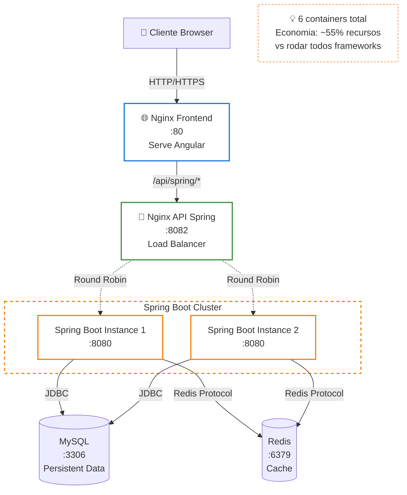

# ☕ Spring Boot Infrastructure

Infraestrutura Docker específica para Spring Boot com load balancing e alta disponibilidade.

## 🏗️ Arquitetura



## 📦 Containers

| Container | Porta | Função | Status |
|-----------|-------|--------|--------|
| **nginx-frontend** | 80 | Serve Angular + Proxy | ✅ Ativo |
| **nginx-api-spring** | 8082 | Load Balancer | ✅ Ativo |
| **spring-boot-app-1** | 8080 | Backend Instance 1 | ✅ Ativo |
| **spring-boot-app-2** | 8080 | Backend Instance 2 | ✅ Ativo |
| **mysql** | 3306 | Database | ✅ Ativo |
| **redis** | 6379 | Cache | ✅ Ativo |

**Total**: 6 containers

## 🚀 Como Usar

### Iniciar Infraestrutura

```bash
cd docker-infrastructure
./start-spring.sh
```

### Verificar Status

```bash
docker-compose -f docker-compose.yml -f docker-compose.spring.yml ps
```

### Ver Logs

```bash
# Todos os containers
docker-compose -f docker-compose.yml -f docker-compose.spring.yml logs -f

# Apenas Spring Boot
docker logs spring-boot-app-1 -f
docker logs spring-boot-app-2 -f

# Apenas Nginx API
docker logs restaurant-nginx-api-spring -f
```

### Parar Infraestrutura

```bash
docker-compose -f docker-compose.yml -f docker-compose.spring.yml down
```

## 🌐 Endpoints

### Via Frontend (Porta 80)

```bash
# Acessar aplicação
http://localhost

# API via proxy
curl http://localhost/api/spring/customers
curl http://localhost/api/spring/menu-items
```

### Via API Gateway (Porta 8082)

```bash
# Acesso direto ao API Gateway
curl http://localhost:8082/api/customers
curl http://localhost:8082/api/menu-items

# Health check
curl http://localhost:8082/health
```

### Swagger UI

```bash
# Documentação interativa da API
http://localhost:8082/swagger-ui.html
```

## ⚡ Load Balancing

O Nginx API Gateway distribui requisições entre as 2 instâncias usando **Round Robin**:

```nginx
upstream backend_spring {
    server spring-boot-app-1:8080;
    server spring-boot-app-2:8080;
}
```

### Testar Load Balancing

```bash
# Fazer múltiplas requisições
for i in {1..10}; do
  curl http://localhost:8082/api/customers
  echo "Request $i"
  sleep 1
done

# Ver logs para confirmar distribuição
docker logs restaurant-nginx-api-spring
```

## 🔧 Configuração

### Variáveis de Ambiente

```yaml
SPRING_DATASOURCE_URL: jdbc:mysql://mysql:3306/restaurant_db
SPRING_DATASOURCE_USERNAME: restaurant_user
SPRING_DATASOURCE_PASSWORD: restaurant123
SPRING_REDIS_HOST: redis
SPRING_REDIS_PORT: 6379
SERVER_PORT: 8080
```

### Tecnologias

| Componente | Tecnologia | Versão |
|------------|------------|--------|
| **Framework** | Spring Boot | 3.5.6 |
| **Web Server** | Undertow | Embedded |
| **Java** | OpenJDK | 21 |
| **Database** | MySQL | 8.0 |
| **Cache** | Redis | 7-alpine |
| **Proxy** | Nginx | alpine |

## 📊 Performance

### Startup Time

- **Spring Boot**: ~2.5-4s
- **Total Infrastructure**: ~15-20s

### Memory Usage

- **Per Instance**: ~150-200 MB
- **Total (2 instances)**: ~300-400 MB
- **MySQL**: ~400 MB
- **Redis**: ~10 MB
- **Nginx**: ~5 MB cada

**Total Infrastructure**: ~720-830 MB

## 🧪 Testes

### Health Checks

```bash
# Spring Boot Actuator
curl http://localhost:8082/actuator/health

# Nginx health
curl http://localhost:8082/health
```

### Teste de Carga

```bash
# Apache Bench
ab -n 1000 -c 10 http://localhost:8082/api/customers

# wrk
wrk -t4 -c100 -d30s http://localhost:8082/api/customers
```

## 🔍 Troubleshooting

### Container não inicia

```bash
# Ver logs de erro
docker logs spring-boot-app-1

# Reconstruir imagem
docker-compose -f docker-compose.yml -f docker-compose.spring.yml build --no-cache spring-boot-app-1
```

### Banco de dados não conecta

```bash
# Verificar MySQL
docker exec -it restaurant-mysql mysql -u restaurant_user -prestaurant123 restaurant_db

# Verificar network
docker network inspect restaurant-network
```

### Load balancing não funciona

```bash
# Verificar configuração Nginx
docker exec restaurant-nginx-api-spring cat /etc/nginx/nginx.conf

# Testar conectividade
docker exec restaurant-nginx-api-spring ping spring-boot-app-1
```

## 📈 Escalabilidade

### Adicionar mais instâncias

Edite `docker-compose.spring.yml` e adicione:

```yaml
spring-boot-app-3:
  build:
    context: ../backend/spring-boot-app
    dockerfile: Dockerfile
  container_name: spring-boot-app-3
  # ... mesma configuração
```

Atualize `nginx-api-spring.conf`:

```nginx
upstream backend_spring {
    server spring-boot-app-1:8080;
    server spring-boot-app-2:8080;
    server spring-boot-app-3:8080;  # Nova instância
}
```

## 🎯 Benefícios

- ✅ **Alta Disponibilidade**: 2 instâncias com failover automático
- ✅ **Load Balancing**: Distribuição automática de carga
- ✅ **Escalabilidade**: Fácil adicionar mais instâncias
- ✅ **Isolamento**: Infraestrutura dedicada ao Spring Boot
- ✅ **Performance**: Undertow web server otimizado
- ✅ **Monitoramento**: Spring Boot Actuator integrado

## 🔗 Links Úteis

- **[Spring Boot Documentation](https://docs.spring.io/spring-boot/)**
- **[Undertow Documentation](https://undertow.io/)**
- **[Docker Compose Reference](https://docs.docker.com/compose/)**
- **[Nginx Load Balancing](https://nginx.org/en/docs/http/load_balancing.html)**

---

**[⬅️ Voltar para Infraestrutura Principal](../README.md)**
