# 🐳 Docker Infrastructure

Infraestrutura completa com Docker para o Restaurant Management System.

## 📋 Visão Geral

Esta infraestrutura fornece:

- **Nginx**: Reverse proxy e load balancer na porta 80
- **Backend Escalável**: Cada framework pode ter até 2 instâncias
- **MySQL**: Banco de dados compartilhado
- **Redis**: Cache compartilhado
- **Frontend**: Servido estaticamente pelo Nginx

## 🏗️ Arquitetura

### Visão Geral da Infraestrutura

```mermaid
graph TB
    Client[👤 Cliente Browser]
    
    subgraph Frontend["🌐 Nginx Frontend :80"]
        FE[Serve Angular<br/>Proxy APIs]
    end
    
    subgraph APIGateways["🔀 API Gateways"]
        GW1[nginx-api-spring<br/>:8082]
        GW2[nginx-api-quarkus<br/>:8081]
        GW3[nginx-api-micronaut<br/>:8083]
    end
    
    subgraph Backends["☕ Backend Instances"]
        SP1[Spring Boot 1]
        SP2[Spring Boot 2]
        QK1[Quarkus 1]
        QK2[Quarkus 2]
        MN1[Micronaut 1]
        MN2[Micronaut 2]
    end
    
    subgraph Data["💾 Dados Compartilhados"]
        DB[(MySQL<br/>:3306)]
        Cache[(Redis<br/>:6379)]
    end
    
    Client --> FE
    FE -->|/api/spring/*| GW1
    FE -->|/api/quarkus/*| GW2
    FE -->|/api/micronaut/*| GW3
    
    GW1 -.Load Balance.-> SP1
    GW1 -.Load Balance.-> SP2
    GW2 -.Load Balance.-> QK1
    GW2 -.Load Balance.-> QK2
    GW3 -.Load Balance.-> MN1
    GW3 -.Load Balance.-> MN2
    
    SP1 & SP2 & QK1 & QK2 & MN1 & MN2 --> DB
    SP1 & SP2 & QK1 & QK2 & MN1 & MN2 --> Cache
    
    style Frontend fill:#E3F2FD
    style APIGateways fill:#C8E6C9
    style Backends fill:#FFF9C4
    style Data fill:#F3E5F5
```



### Arquitetura Modular (Docker Compose)


### Cenário: Apenas Spring Boot

```mermaid
graph TB
    Client[👤 Cliente]
    Frontend[🌐 Nginx Frontend<br/>:80]
    SpringGW[🔀 nginx-api-spring<br/>:8082]
    
    subgraph SpringCluster["Spring Boot Cluster"]
        SP1[Spring Boot 1<br/>:8080]
        SP2[Spring Boot 2<br/>:8080]
    end
    
    DB[(MySQL<br/>:3306)]
    Cache[(Redis<br/>:6379)]
    
    Client --> Frontend
    Frontend -->|/api/spring/*| SpringGW
    SpringGW -.Round Robin.-> SP1
    SpringGW -.Round Robin.-> SP2
    SP1 & SP2 --> DB & Cache
    
    Note[💡 Apenas 6 containers<br/>Economia: ~55% recursos]
    
    style Frontend fill:#E3F2FD
    style SpringGW fill:#C8E6C9
    style SpringCluster fill:#FFF9C4
    style Note fill:#FFECB3
```



## 🎨 Setup do Frontend (IMPORTANTE!)

⚠️ **O frontend precisa ser construído antes de iniciar a infraestrutura!**

```bash
# Opção 1: Script automático (recomendado)
./build-frontend.sh

# Opção 2: Build manual
cd ../frontend-angular
npm run build --prod
cp -r dist/* ../docker-infrastructure/frontend/dist/
```

Para desenvolvimento ativo do frontend, veja [frontend/README.md](frontend/README.md).

## 🌐 Arquitetura Dual Nginx

A infraestrutura utiliza **dois Nginx separados** para melhor separação de responsabilidades:

### 1. Nginx Frontend (Port 80)
- ✅ Serve arquivos estáticos do Angular
- ✅ Proxy `/api/*` para API Gateway
- ✅ Cache otimizado para frontend
- ✅ Container: `restaurant-nginx-frontend`

### 2. Nginx API Gateway (Port 8080)
- ✅ Load balancer para backends
- ✅ Roteamento de APIs
- ✅ CORS e headers
- ✅ Container: `restaurant-nginx-api`

**Benefícios**: Escalabilidade independente, configurações otimizadas, melhor segurança.

📚 Documentação completa: [nginx/README.md](nginx/README.md)

## 🚀 Como Usar

### 1. Iniciar TODOS os Backends (6 instâncias)

```bash
cd docker-infrastructure
./start-all.sh
```

### 2. Iniciar Apenas UM Backend Específico

```bash
# Apenas Spring Boot (2 instâncias)
./start-spring.sh

# Apenas Quarkus (2 instâncias)
./start-quarkus.sh

# Apenas Micronaut (2 instâncias)
./start-micronaut.sh
```

### 3. Uso Manual com docker-compose

```bash
# Spring Boot apenas
docker-compose -f docker-compose.yml -f docker-compose.spring.yml up -d

# Quarkus apenas
docker-compose -f docker-compose.yml -f docker-compose.quarkus.yml up -d

# Micronaut apenas
docker-compose -f docker-compose.yml -f docker-compose.micronaut.yml up -d

# Combinar múltiplos backends
docker-compose -f docker-compose.yml \
               -f docker-compose.spring.yml \
               -f docker-compose.quarkus.yml \
               up -d
```

### 4. Ver Logs

```bash
# Todos os serviços
docker-compose logs -f

# Serviço específico
docker-compose logs -f nginx
docker-compose logs -f spring-boot-app-1
docker-compose logs -f mysql
```

### 5. Parar Serviços

```bash
# Parar todos
docker-compose down

# Parar e remover volumes
docker-compose down -v
```

### 6. Verificar Status

```bash
docker-compose ps
```

## 🌐 Endpoints

### Frontend
- **URL**: http://localhost
- Servido estaticamente pelo Nginx

### Backend APIs (via Nginx)

| Framework | Endpoint | Backend Instances |
|-----------|----------|-------------------|
| **Spring Boot** | http://localhost/api/spring/* | 2 instâncias |
| **Quarkus** | http://localhost/api/quarkus/* | 2 instâncias |
| **Micronaut** | http://localhost/api/micronaut/* | 2 instâncias |

### Exemplos de Requisições

```bash
# Spring Boot - Load balanced entre 2 instâncias
curl http://localhost/api/spring/customers

# Quarkus - Load balanced entre 2 instâncias
curl http://localhost/api/quarkus/customers

# Micronaut - Load balanced entre 2 instâncias
curl http://localhost/api/micronaut/customers
```

### Serviços Diretos (sem Nginx)

| Serviço | Porta | URL |
|---------|-------|-----|
| **MySQL** | 3306 | localhost:3306 |
| **Redis** | 6379 | localhost:6379 |

## 📦 Estrutura de Pastas (Modular)

```
docker-infrastructure/
├── docker-compose.yml              # Base: MySQL, Redis, Nginx
├── docker-compose.spring.yml      # Spring Boot (2 instâncias)
├── docker-compose.quarkus.yml     # Quarkus (2 instâncias)
├── docker-compose.micronaut.yml   # Micronaut (2 instâncias)
│
├── start-all.sh                   # Inicia TODOS os backends
├── start-spring.sh                # Inicia apenas Spring Boot
├── start-quarkus.sh               # Inicia apenas Quarkus
├── start-micronaut.sh             # Inicia apenas Micronaut
├── stop-all.sh                    # Para tudo
├── scale-backend.sh               # Script genérico
│
├── nginx/
│   └── nginx.conf                 # Configuração Nginx (load balancer)
├── mysql/
│   └── init.sql                   # Script de inicialização do banco
├── backend/
│   ├── Dockerfile.spring-boot
│   ├── Dockerfile.quarkus
│   └── Dockerfile.micronaut
└── frontend/
    └── dist/                      # Build do Angular (copiar aqui)
```

### 🎯 Arquitetura Modular

A infraestrutura é **modular**: cada backend tem seu próprio arquivo `docker-compose`. Isso permite:

- ✅ Iniciar apenas o backend que você precisa
- ✅ Economizar recursos (não precisa rodar todos)
- ✅ Testes isolados por framework
- ✅ Combinar backends conforme necessário
- ✅ Manutenção simplificada

**Exemplo**: Se você só trabalha com Spring Boot, use apenas `docker-compose.spring.yml`!

## 🔧 Configuração

### Variáveis de Ambiente

Todas as configurações podem ser ajustadas no `docker-compose.yml`:

**MySQL**:
- `MYSQL_ROOT_PASSWORD`: root123
- `MYSQL_DATABASE`: restaurant_db
- `MYSQL_USER`: restaurant_user
- `MYSQL_PASSWORD`: restaurant123

**Backend**:
- Configurado para conectar automaticamente ao MySQL e Redis
- Porta interna: 8080 (não exposta externamente)
- Acesso apenas via Nginx na porta 80

### Load Balancing

O Nginx usa **round-robin** por padrão para distribuir requisições entre as instâncias.

Configuração em `nginx/nginx.conf`:
```nginx
upstream backend_spring {
    server spring-boot-app-1:8080;
    server spring-boot-app-2:8080;
}
```

## 🧪 Testando Load Balancing

```bash
# Fazer múltiplas requisições e ver distribuição
for i in {1..10}; do
  curl http://localhost/api/spring/customers
  echo "Request $i"
  sleep 1
done
```

Verifique nos logs qual instância respondeu:
```bash
docker-compose logs -f spring-boot-app-1 spring-boot-app-2
```

## 📊 Monitoramento

### Health Checks

```bash
# Nginx health
curl http://localhost/health

# Ver status dos containers
docker-compose ps

# Ver recursos utilizados
docker stats
```

### Logs Centralizados

```bash
# Todos os backends
docker-compose logs -f spring-boot-app-1 spring-boot-app-2 \
                       quarkus-app-1 quarkus-app-2 \
                       micronaut-app-1 micronaut-app-2
```

## 🛠️ Troubleshooting

### Problema: Container não inicia

```bash
# Verificar logs
docker-compose logs [service-name]

# Reconstruir imagem
docker-compose build --no-cache [service-name]
```

### Problema: Banco de dados não conecta

```bash
# Verificar se MySQL está rodando
docker-compose ps mysql

# Testar conexão
docker-compose exec mysql mysql -u restaurant_user -prestaurant123 restaurant_db
```

### Problema: Nginx não acessa backend

```bash
# Verificar configuração
docker-compose exec nginx cat /etc/nginx/nginx.conf

# Testar conectividade
docker-compose exec nginx ping spring-boot-app-1
```

## 🔄 Atualizar Aplicações

```bash
# Rebuild e restart
docker-compose up -d --build [service-name]

# Exemplo: Atualizar apenas Spring Boot
docker-compose up -d --build spring-boot-app-1 spring-boot-app-2
```

## 🎯 Próximos Passos

1. **Copiar build do frontend**: `cp -r ../frontend-angular/dist docker-infrastructure/frontend/`
2. **Ajustar Dockerfiles** se necessário para seu ambiente
3. **Configurar CI/CD** para builds automatizados
4. **Adicionar monitoring** (Prometheus + Grafana)
5. **Configurar SSL** para HTTPS

## 📝 Notas Importantes

- ⚠️ Esta configuração é para **desenvolvimento/teste**
- 🔒 Para **produção**, adicione SSL, secrets management, e hardening
- 📈 O load balancing é básico (round-robin). Para produção, considere algoritmos mais sofisticados
- 💾 Os dados do MySQL são persistidos em volume Docker
- 🔄 As instâncias backend compartilham o mesmo banco de dados e cache

## 🚀 Deploy em Produção

Para produção, considere:
- Usar Docker Swarm ou Kubernetes
- Adicionar secrets management
- Configurar SSL/TLS
- Implementar monitoring e alerting
- Adicionar backup automatizado do MySQL
- Usar imagens multi-stage otimizadas
- Configurar resource limits

---

**Documentação completa**: [../docs/](../docs/)
