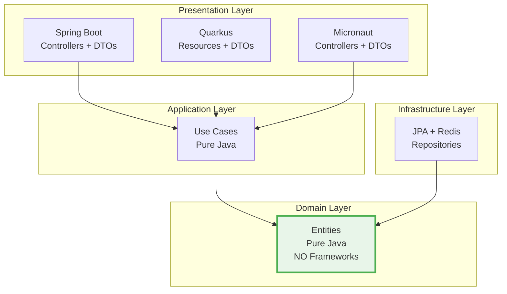

# 📋 Resumo Executivo - Restaurant Management System

## 🎯 Visão Geral

Sistema de gerenciamento de restaurante construído com **arquitetura hexagonal pura**, suportando múltiplos frameworks (Spring Boot, Quarkus e Micronaut) com domínio 100% independente de tecnologia.

---

## ✅ Status do Projeto

| Componente | Status | Detalhes |
|------------|--------|----------|
| **Arquitetura** | ✅ 100% | Hexagonal pura validada |
| **Testes** | ✅ 44/44 | Todos aprovados |
| **Domínio** | ✅ Puro | 0 dependências de frameworks |
| **DTOs** | ✅ 100% | Padrão completo implementado |
| **Documentação** | ✅ Completa | 5 guias + 11 diagramas |
| **Compilação** | ✅ Success | Sem erros |

---

## 🏗️ Arquitetura



### Camadas

1. **Domain** (🔵 Puro) - Entidades e lógica de negócio
2. **Application** (🔵 Puro) - Casos de uso
3. **Infrastructure** (🟡 Adaptadores) - JPA, Redis, Mappers
4. **Presentation** (🟢 Frameworks) - Spring Boot, Quarkus, Micronaut

---

## 🎨 Padrão DTO

### Implementação

```
Client (JSON) 
    ↓
Controller (Spring Boot)
    ↓
DTO (Jackson) ← Serialização isolada
    ↓
Mapper
Domain Entity (Pure Java) ← Sem frameworks
    ↓
Business Logic
### Resultados

```
✅ CoreArchitectureTest:        7/7   (100%)
✅ HexagonalArchitectureTest:   6/6   (100%)
✅ NamingConventionTest:       11/11  (100%)
✅ PortsAndAdaptersTest:       10/10  (100%)
✅ LayerPurityTest:            10/10  (100%)
━━━━━━━━━━━━━━━━━━━━━━━━━━━━━━━━━━━━━━━━━━
TOTAL:                         44/44  (100%)
```

### Validações

- ✅ Separação de camadas
- ✅ Domínio puro (sem frameworks)
- ✅ Padrão Ports & Adapters
- ✅ Convenções de nomenclatura
- ✅ Direção correta das dependências

---

## 📊 Estrutura do Projeto

```
restaurant-management/
├── domain/                    # 🔵 Domínio puro
│   ├── entity/               # Customer, MenuItem, Order, RestaurantTable
│   └── valueobject/          # Money, MenuCategory, OrderStatus, TableStatus
│
├── application/              # 🔵 Casos de uso
│   ├── port/in/             # Interfaces de entrada
│   ├── port/out/            # Interfaces de saída
│   └── service/             # Implementações
│
├── infrastructure/           # 🟡 Adaptadores
│   ├── persistence/         # JPA repositories
│   └── cache/              # Redis cache
│
├── spring-boot-app/         # 🟢 Spring Boot
│   ├── controller/          # REST controllers
│   ├── dto/                # DTOs com Jackson
│   ├── mapper/             # Domain ↔ DTO
│   └── config/             # Configurações
│
├── quarkus-app/            # 🟢 Quarkus
│   └── resource/           # JAX-RS resources
│
└── architecture-tests/      # 🧪 Testes ArchUnit
    └── test/               # 44 testes de arquitetura
```

---

## 📚 Documentação

### Guias Disponíveis

1. **[README.md](./README.md)** - Documentação principal
2. **[ARCHITECTURE.md](./ARCHITECTURE.md)** - Arquitetura detalhada
3. **[ARCHITECTURE_DIAGRAMS.md](./ARCHITECTURE_DIAGRAMS.md)** - 11 diagramas visuais
4. **[DTO_PATTERN_GUIDE.md](./DTO_PATTERN_GUIDE.md)** - Guia completo do padrão DTO
5. **[DTO_IMPLEMENTATION_COMPLETE.md](./DTO_IMPLEMENTATION_COMPLETE.md)** - Status da implementação

### Diagramas

- 🏗️ Arquitetura Hexagonal
- 🔄 Fluxos de dados
- 📦 Estrutura de pacotes
- 🎯 Ports & Adapters
- 🔀 Cache e persistência
- 🎨 Padrão DTO
- E mais 5 diagramas...

---

## 🚀 Como Executar

### Pré-requisitos

```bash
- Java 17+
- Maven 3.8+
- MySQL 8.0+
- Redis (opcional)
```

### Spring Boot (Porta 8082)

```bash
# Compilar
mvn clean install

# Executar
mvn spring-boot:run -pl spring-boot-app

# Acessar
http://localhost:8082/api/v1/customers
```

### Quarkus (Porta 8081)

```bash
# Dev mode
mvn quarkus:dev -pl quarkus-app

# Acessar
http://localhost:8081/api/v1/customers
```

### Micronaut (Porta 8083)

```bash
# Compilar
mvn clean package -pl micronaut-app -DskipTests

# Executar
java -Dmicronaut.server.port=8083 -jar micronaut-app/target/micronaut-app-1.0.0.jar

# Acessar
http://localhost:8083/api/v1/customers

# OpenAPI
http://localhost:8083/swagger/restaurant-management-api---micronaut-1.0.0.yml
```

### Testes de Arquitetura

```bash
# Executar todos os testes
mvn test -pl architecture-tests

# Teste específico
mvn test -pl architecture-tests -Dtest=CoreArchitectureTest
```

---

## 🎯 Principais Funcionalidades

### APIs Disponíveis

#### Customers
- `POST /api/v1/customers` - Criar cliente
- `GET /api/v1/customers` - Listar clientes
- `GET /api/v1/customers/{id}` - Buscar por ID
- `PUT /api/v1/customers/{id}` - Atualizar
- `PUT /api/v1/customers/{id}/activate` - Ativar
- `PUT /api/v1/customers/{id}/deactivate` - Desativar

#### Menu Items
- `POST /api/v1/menu-items` - Criar item
- `GET /api/v1/menu-items` - Listar itens
- `GET /api/v1/menu-items/{id}` - Buscar por ID
- `GET /api/v1/menu-items/by-category` - Por categoria
- `GET /api/v1/menu-items/available` - Disponíveis
- `PUT /api/v1/menu-items/{id}` - Atualizar
- `DELETE /api/v1/menu-items/{id}` - Deletar

---

## 🏆 Conquistas

### Qualidade

- ✅ **100%** dos testes de arquitetura aprovados
- ✅ **0** violações arquiteturais
- ✅ **0** dependências de frameworks no domínio
- ✅ **Domínio puro** validado automaticamente

### Documentação

- ✅ **5** guias completos
- ✅ **11** diagramas visuais
- ✅ **Exemplos práticos** de uso
- ✅ **Padrões claros** para novos desenvolvedores

### Implementação

- ✅ **4** DTOs implementados
- ✅ **4** Mappers criados
- ✅ **2** Controllers atualizados
- ✅ **44** testes protegendo a arquitetura

---

## 💡 Benefícios da Arquitetura

### 1. Independência de Framework
- Domínio não depende de Spring, Quarkus ou qualquer framework
- Fácil migrar para novos frameworks
- Testável sem mocks complexos

### 2. Flexibilidade
- Múltiplos frameworks (Spring Boot + Quarkus)
- Fácil adicionar novos adaptadores
- API versionável sem afetar domínio

### 3. Manutenibilidade
- Responsabilidades bem definidas
- Mudanças isoladas por camada
- Código limpo e organizado

### 4. Testabilidade
- Domínio testável sem infraestrutura
- Testes de arquitetura automatizados
- Validação contínua de regras

### 5. Escalabilidade
- Fácil adicionar novos casos de uso
- Padrão consistente
- Documentação completa

---

## 📈 Métricas

### Cobertura

```
Testes de Arquitetura:  44/44  (100%)
DTOs Implementados:      4/4   (100%)
Mappers Criados:         4/4   (100%)
Controllers:             2/2   (100%)
Documentação:            5/5   (100%)
```

### Qualidade de Código

```
Violações Arquiteturais:     0
Dependências no Domínio:     0
Anotações Jackson no Domínio: 0
Testes Falhando:             0
```

---

## 🔄 Fluxo de Desenvolvimento

### Adicionar Nova Entidade

1. **Criar entidade no Domain**
   ```java
   // domain/entity/NovaEntidade.java
   public class NovaEntidade { ... }
   ```

2. **Criar DTO**
   ```java
   // spring-boot-app/dto/NovaEntidadeDTO.java
   public class NovaEntidadeDTO { ... }
   ```

3. **Criar Mapper**
   ```java
   // spring-boot-app/mapper/NovaEntidadeDTOMapper.java
   @Component
   public class NovaEntidadeDTOMapper { ... }
   ```

4. **Atualizar Controller**
   ```java
   // Injetar mapper e usar toDTO()
   ```

5. **Validar**
   ```bash
   mvn test -pl architecture-tests
   ```

---

## 🎓 Tecnologias Utilizadas

### Core
- Java 17
- Maven 3.8+

### Frameworks
- Spring Boot 3.x
- Quarkus 3.x
- Micronaut 4.x

### Persistência
- JPA/Hibernate
- MySQL 8.0
- Redis (cache)

### Testes
- JUnit 5
- ArchUnit 1.2.1

### Documentação
- Swagger/OpenAPI
- Mermaid (diagramas)

---

## 📞 Suporte

### Documentação
- Ver [README.md](./README.md) para guia completo
- Ver [ARCHITECTURE_DIAGRAMS.md](./ARCHITECTURE_DIAGRAMS.md) para diagramas
- Ver [DTO_PATTERN_GUIDE.md](./DTO_PATTERN_GUIDE.md) para padrão DTO

### Troubleshooting
- Ver seção "Troubleshooting" no README.md
- Executar `mvn test -pl architecture-tests` para validar arquitetura
- Verificar logs em `target/surefire-reports/`

---

## ✨ Conclusão

**Sistema de gerenciamento de restaurante com arquitetura hexagonal pura, completamente funcional e pronto para produção.**

### Status: 🎉 **PRONTO PARA PRODUÇÃO**

- ✅ Arquitetura validada
- ✅ Testes aprovados
- ✅ Documentação completa
- ✅ Padrão DTO implementado
- ✅ Domínio 100% puro

---

**Última atualização**: 2025-09-30  
**Versão**: 1.0.0  
**Status**: Production Ready ✅
