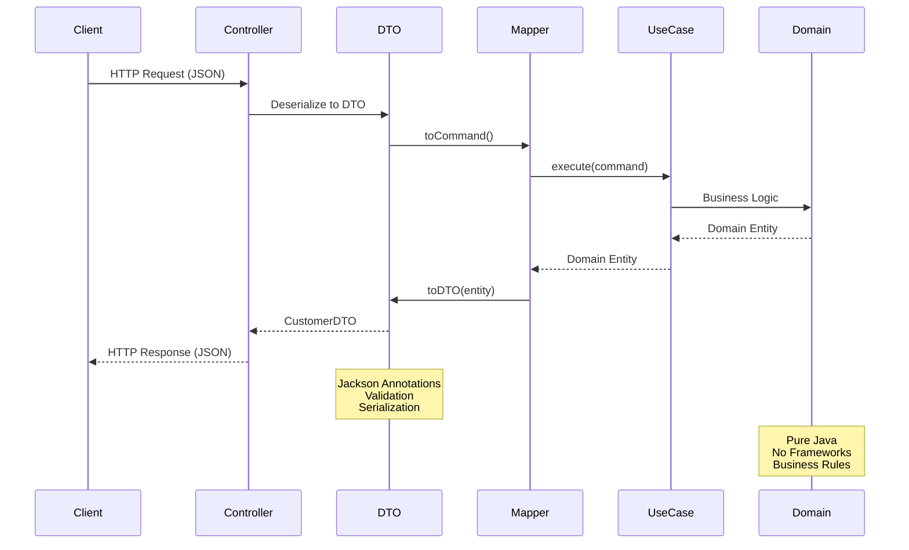
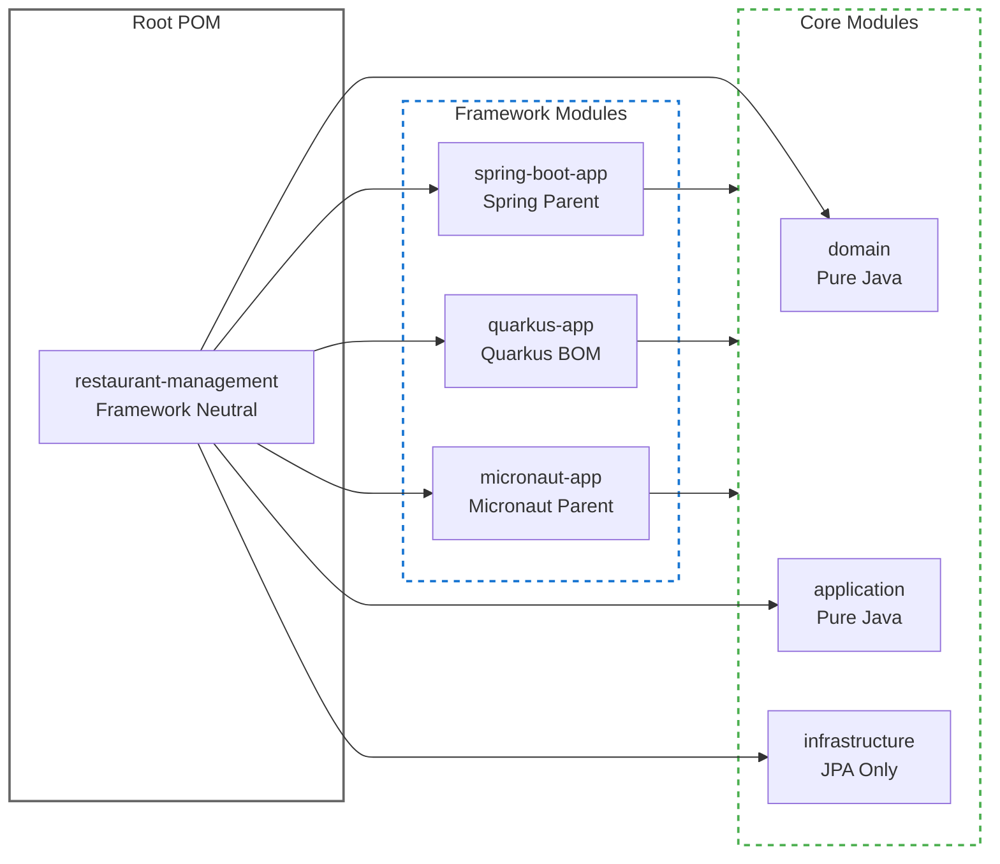

# Hexagonal Architecture Implementation

## Overview

This project implements a **pure hexagonal architecture** (also known as ports and adapters pattern) that ensures complete framework independence in the core business logic while allowing multiple framework implementations.

## Architecture Layers

### 🔵 Core Layers (Framework Independent)

#### 1. Domain Layer (`domain/`)
- **Purpose**: Contains the core business entities and domain logic
- **Dependencies**: None (pure Java)
- **Key Components**:
  - `Customer`: Core customer entity with business rules
  - `MenuItem`: Menu item entity with pricing and availability logic
  - `Order`: Order aggregate with business validation
  - Value objects and domain services

#### 2. Application Layer (`application/`)
- **Purpose**: Orchestrates business use cases and application services
- **Dependencies**: Only domain layer
- **Key Components**:
  - **Ports In** (`port/in/`): Use case interfaces (CustomerUseCase, MenuUseCase)
  - **Ports Out** (`port/out/`): Repository and service interfaces
  - **Services** (`service/`): Use case implementations (CustomerService, MenuService)

### 🟡 Infrastructure Layer (`infrastructure/`)
- **Purpose**: Implements external adapters and technical concerns
- **Dependencies**: Application and domain layers (but no specific frameworks)
- **Key Components**:
  - **Persistence**: JPA entities and repository implementations
  - **Cache**: Redis cache service implementation
  - **Mappers**: Entity-to-domain object mappers

### 🟢 Application Frameworks (Framework Specific)

#### Spring Boot Application (`spring-boot-app/`)
- **Purpose**: REST API implementation using Spring Boot
- **Status**: ✅ Fully functional
- **Key Features**:
  - REST controllers for Customer and Menu management
  - Spring dependency injection configuration
  - JPA/Hibernate integration
  - Redis caching
  - Health checks and monitoring

#### Quarkus Application (`quarkus-app/`)
- **Purpose**: Alternative REST API implementation using Quarkus
- **Status**: ⚠️ Requires EntityManager configuration
- **Key Features**:
  - JAX-RS controllers
  - CDI dependency injection
  - Native compilation support

## Visual Architecture

For detailed visual diagrams with Mermaid, see **[ARCHITECTURE_DIAGRAMS.md](./ARCHITECTURE_DIAGRAMS.md)**

### DTO Pattern Implementation



## Dependency Flow

```mermaid
flowchart TB
    subgraph Frameworks["🔌 Framework Adapters (Driving)"]
        Spring[Spring Boot<br/>Port 8082]
        Quarkus[Quarkus<br/>Port 8081]
        Micronaut[Micronaut<br/>Port 8083]
    end
    
    subgraph Infra["🔧 Infrastructure (Driven)"]
        JPA[JPA Repository<br/>MySQL]
        Redis[Redis Cache]
    end
    
    subgraph App["📍 Application Layer"]
        PortIn[Input Ports<br/>Use Case Interfaces]
        PortOut[Output Ports<br/>Repository Interfaces]
        Services[Use Case<br/>Implementations]
    end
    
    subgraph Dom["⬡ Domain Layer"]
        Entities[Domain Entities<br/>Business Logic<br/>Pure Java]
    end
    
    Spring --> PortIn
    Quarkus --> PortIn
    Micronaut --> PortIn
    
    PortIn --> Services
    Services --> Entities
    Services --> PortOut
    
    PortOut --> JPA
    PortOut --> Redis
    
    JPA --> Entities
    Redis --> Entities
    
    style Frameworks fill:none,stroke:#1976D2,stroke-width:2px,stroke-dasharray: 5 5
    style Infra fill:none,stroke:#F57C00,stroke-width:2px,stroke-dasharray: 5 5
    style App fill:none,stroke:#7B1FA2,stroke-width:2px,stroke-dasharray: 5 5
    style Dom fill:none,stroke:#4caf50,stroke-width:4px
    style Entities fill:none,stroke:#4caf50,stroke-width:3px
```



## Key Architectural Decisions

### 1. Framework Independence
- Core modules (`domain`, `application`, `infrastructure`) use only standard Java
- No Spring or Quarkus annotations in core business logic
- Repository implementations use plain JPA without framework-specific annotations

### 2. Dependency Inversion
- Business logic defines interfaces (ports)
- Infrastructure implements these interfaces (adapters)
- Application frameworks wire dependencies together

### 3. Multiple Framework Support
- Same business logic exposed through different frameworks
- Each framework has its own configuration and dependency injection
- Shared infrastructure implementations

### 4. Clean Module Boundaries




## Configuration Patterns

### Spring Boot Configuration

```java
@Configuration
public class ApplicationConfig {
    
    @Bean
    public CustomerRepository customerRepository(EntityManager entityManager) {
        return new JpaCustomerRepository(entityManager);
    }
    
    @Bean
    public CustomerUseCase customerUseCase(CustomerRepository repository, CacheService cache) {
        return new CustomerService(repository, cache);
    }
}
```

### Repository Implementation (Framework Independent)

```java
public class JpaCustomerRepository implements CustomerRepository {
    
    private final EntityManager entityManager;
    
    public JpaCustomerRepository(EntityManager entityManager) {
        this.entityManager = entityManager;
    }
    
    @Override
    @Transactional  // Using Jakarta EE, not Spring
    public Customer save(Customer customer) {
        // Implementation using pure JPA
    }
}
```

## Benefits of This Architecture

1. **Testability**: Easy to unit test business logic without frameworks
2. **Flexibility**: Can switch frameworks without changing business logic
3. **Maintainability**: Clear separation of concerns
4. **Evolution**: Can add new frameworks or change existing ones
5. **Performance**: Can optimize different implementations for different needs

## Testing Strategy

### 🧪 Architecture Tests (`architecture-tests/`)

Automated verification of architectural rules using **ArchUnit**:

- **Hexagonal Architecture Compliance**: Verifies layer dependencies and isolation
- **Naming Conventions**: Ensures consistent naming patterns across the codebase
- **Ports and Adapters**: Validates correct implementation of the pattern
- **Layer Purity**: Ensures each layer only uses appropriate dependencies

#### Key Architecture Rules Enforced

```java
// Domain layer must be pure (no framework dependencies)
@Test
void domainLayerShouldNotDependOnAnyOtherLayer() {
    noClasses()
        .that().resideInAPackage("..domain..")
        .should().dependOnClassesThat()
        .resideInAnyPackage("..application..", "..infrastructure..");
}

// Application layer should only depend on domain
@Test
void applicationLayerShouldOnlyDependOnDomainLayer() {
    noClasses()
        .that().resideInAPackage("..application..")
        .should().dependOnClassesThat()
        .resideInAnyPackage("..infrastructure..");
}
```

#### Running Architecture Tests

```bash
# Run all architecture tests
mvn test -pl architecture-tests

# Run specific test class
mvn test -pl architecture-tests -Dtest=HexagonalArchitectureTest
```


### 📋 Other Testing Levels

- **Unit Tests**: Test domain logic in isolation
- **Integration Tests**: Test use cases with in-memory implementations
- **Framework Tests**: Test REST endpoints and framework integration
- **Contract Tests**: Ensure all implementations satisfy the same contracts

## Migration Path

To add a new framework (e.g., Micronaut):
1. Create new module `micronaut-app/`
2. Add framework-specific dependencies
3. Implement REST controllers
4. Configure dependency injection
5. Wire existing infrastructure implementations

The core business logic remains unchanged.
