# 📊 Diagramas de Arquitetura - Restaurant Management System

## 🏗️ Arquitetura Hexagonal

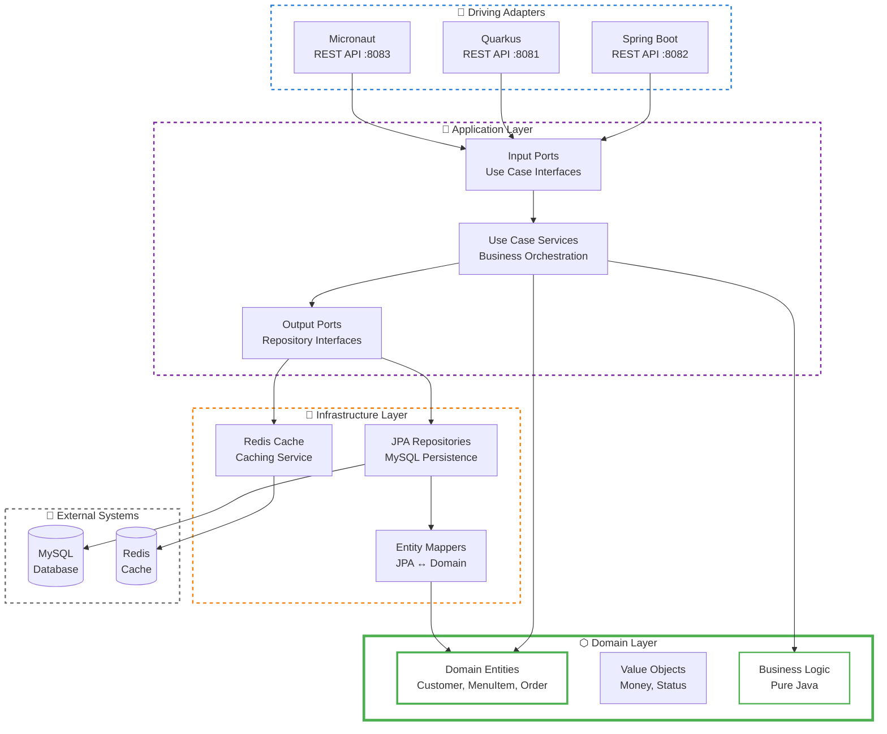

## 🔄 Fluxo de Criação de Customer

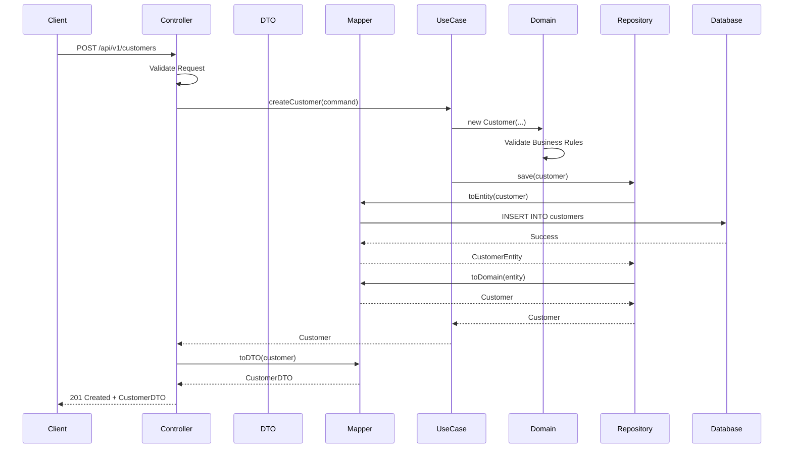

## 📦 Estrutura de Pacotes

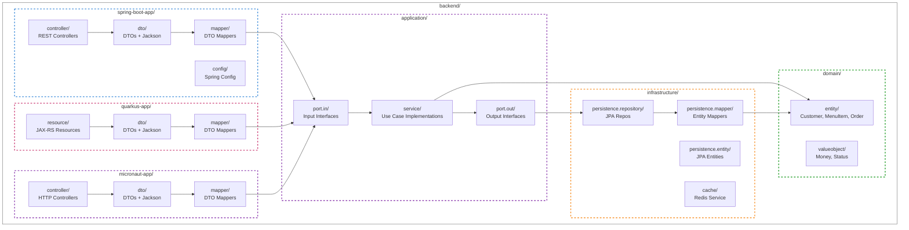

## 🎯 Padrão Ports & Adapters

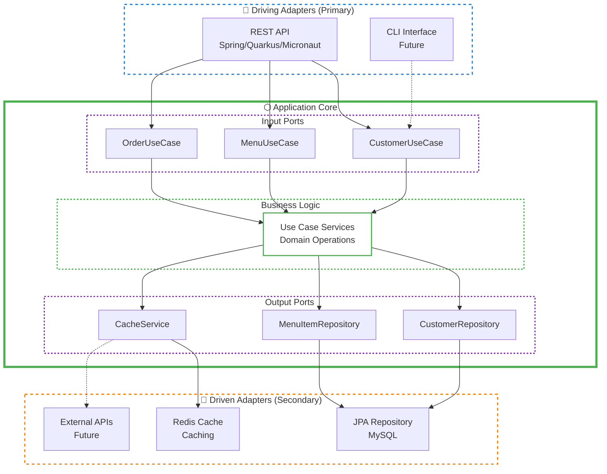

## 🔀 Fluxo de Dados com Cache

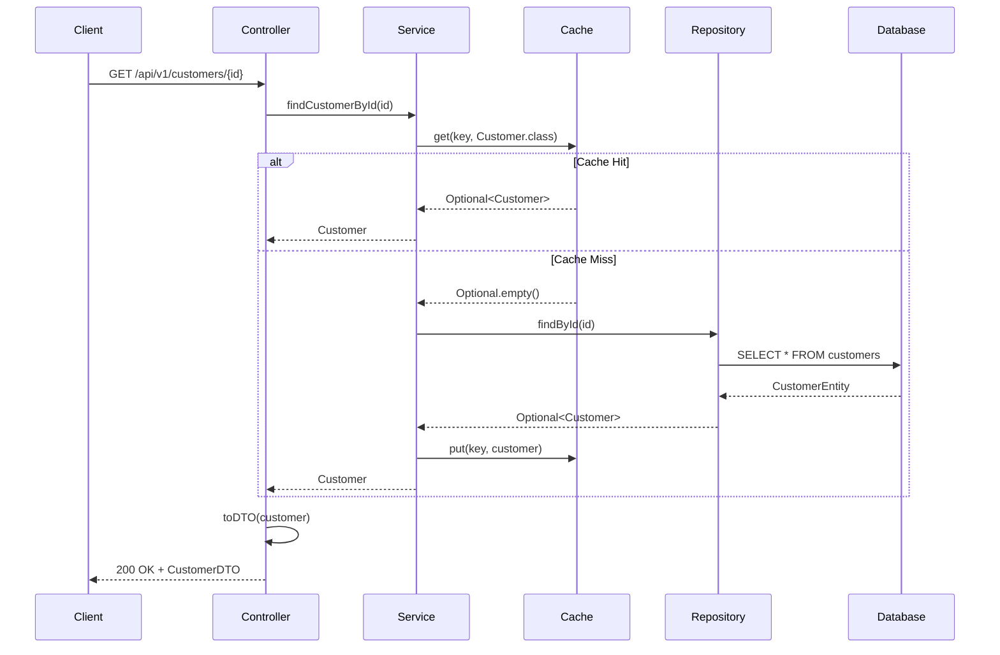

## 🏛️ Camadas e Dependências

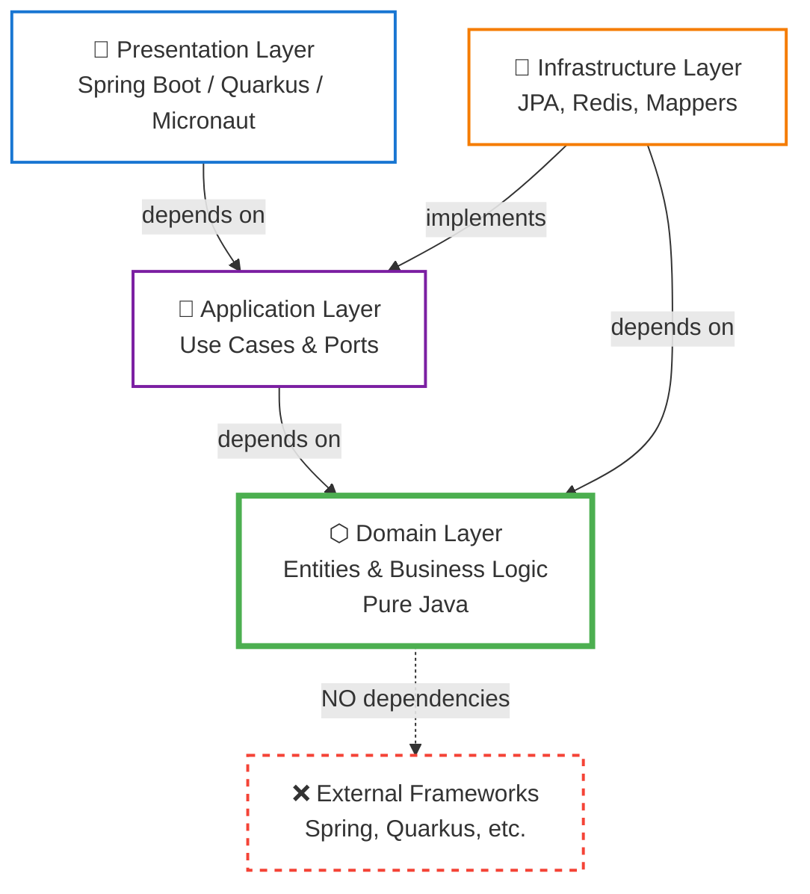

## 🔐 Fluxo de Validação

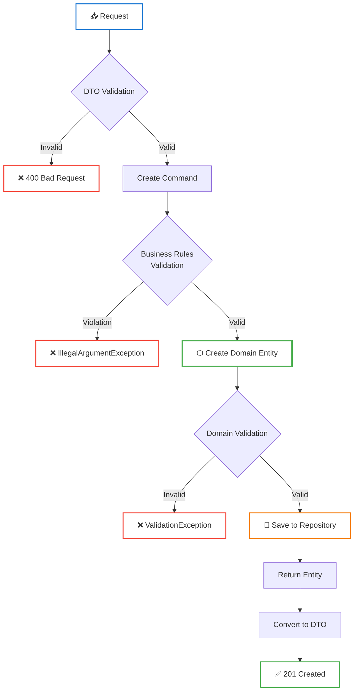

## 🔄 Ciclo de Vida do Pedido

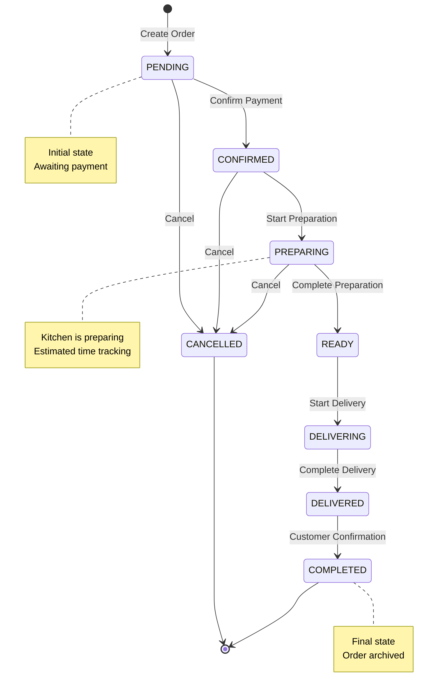

## 🏢 Arquitetura Multi-Framework

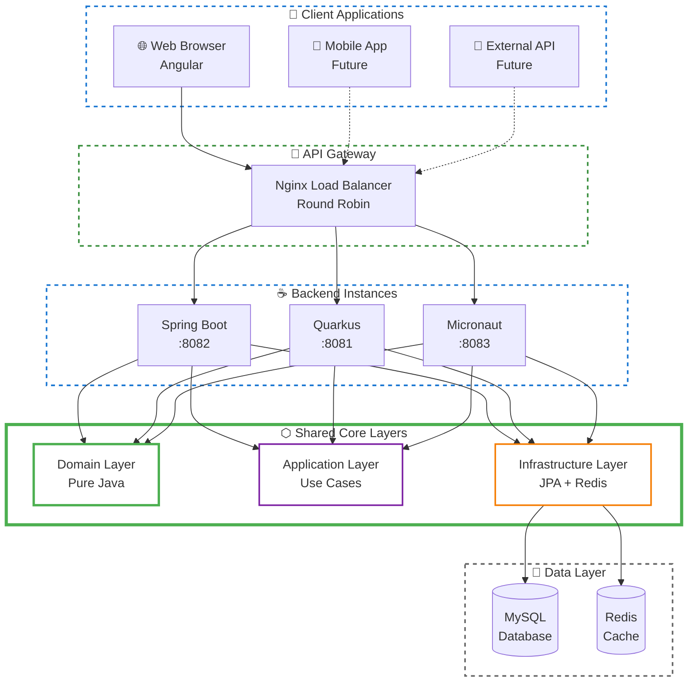

## 📊 Fluxo de Testes de Arquitetura

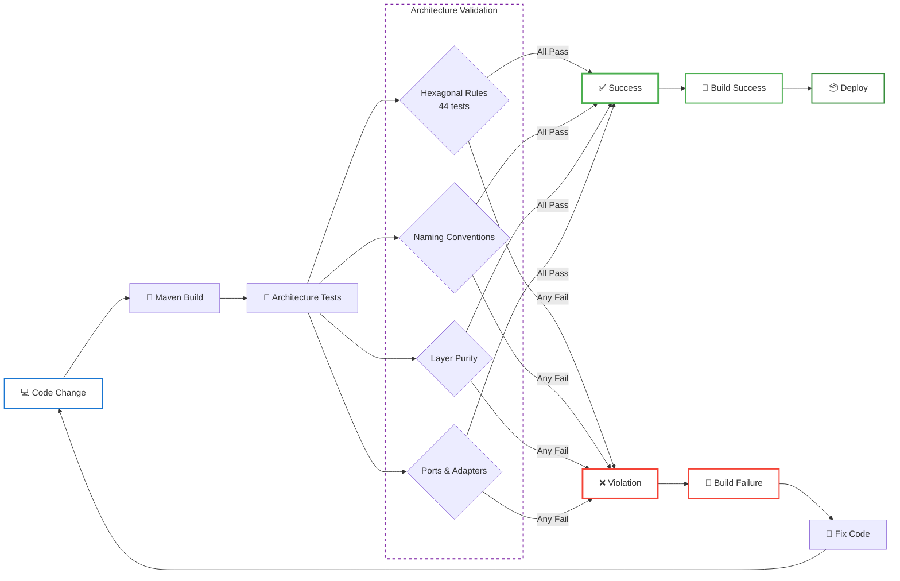

## 🎨 Padrão DTO vs Domain

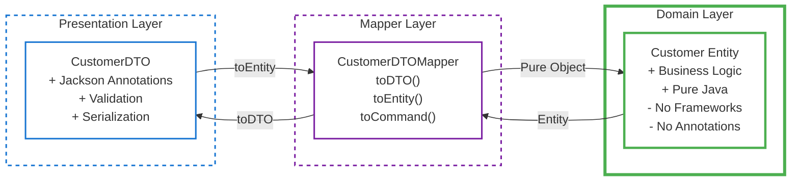

---

## 📚 Legenda de Estilos

### Cores das Bordas

- 🟢 **Verde** (#4caf50): Domain Layer (Puro, sem frameworks)
- 🟣 **Roxo** (#7B1FA2): Application Layer / Ports (Interfaces)
- 🟠 **Laranja** (#F57C00): Infrastructure Layer (Driven Adapters)
- 🔵 **Azul** (#1976D2): Presentation Layer (Driving Adapters)
- 🔴 **Vermelho** (#f44336): Erros ou Violações

### Estilos de Linha

- **Sólida**: Componentes individuais
- **Pontilhada (5 5)**: Agrupamentos de camadas
- **Pontilhada (3 3)**: Sub-agrupamentos
- **Espessura 4px**: Hexagon Core (destaque)
- **Espessura 3px**: Entidades Domain
- **Espessura 2px**: Demais componentes

---

## 🔗 Links Relacionados

- [ARCHITECTURE.md](./ARCHITECTURE.md) - Documentação detalhada da arquitetura
- [ARCHITECTURE_TESTS_SUMMARY.md](./ARCHITECTURE_TESTS_SUMMARY.md) - Resumo dos testes
- [README.md](./README.md) - Guia principal do projeto
