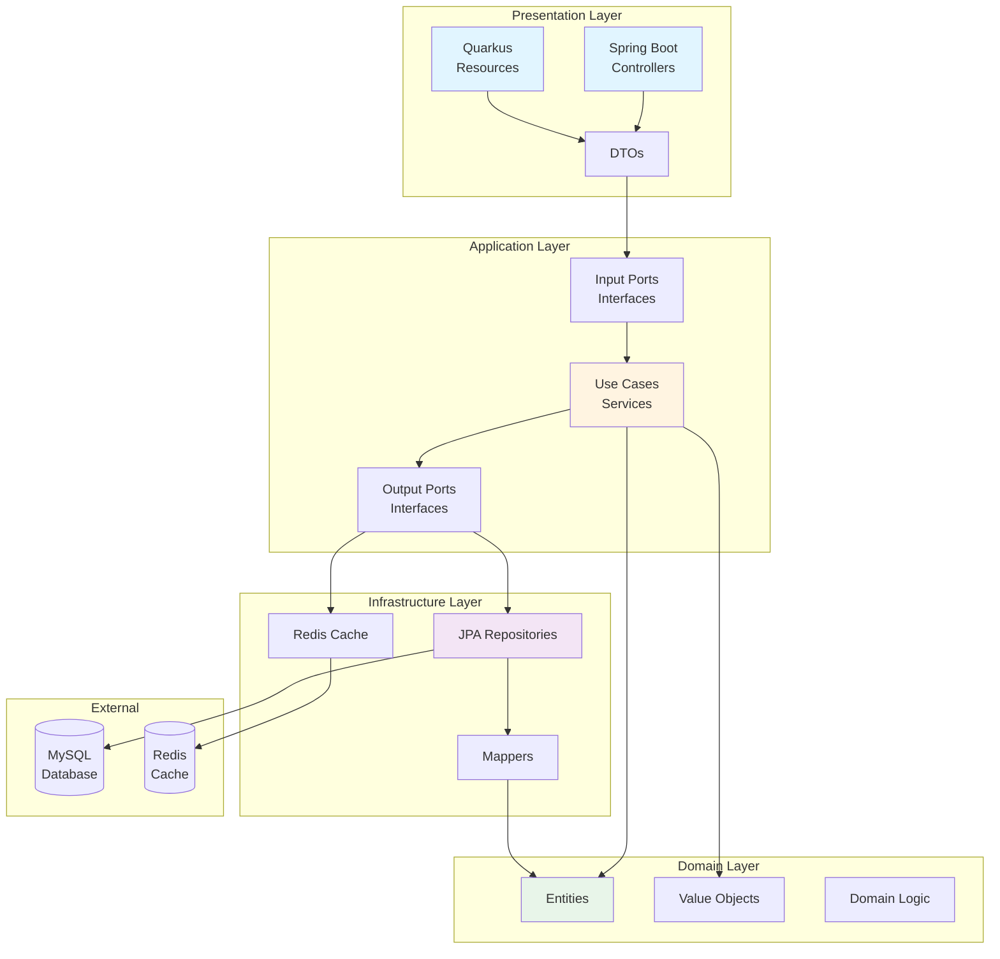
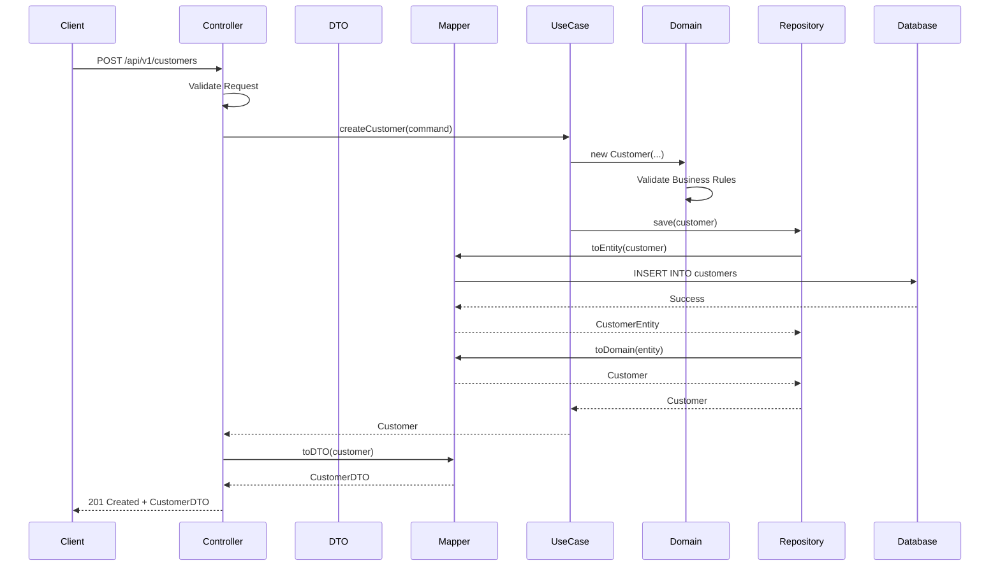
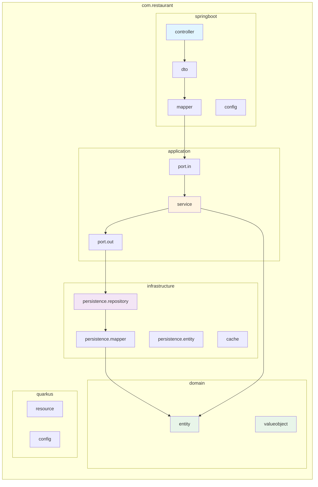
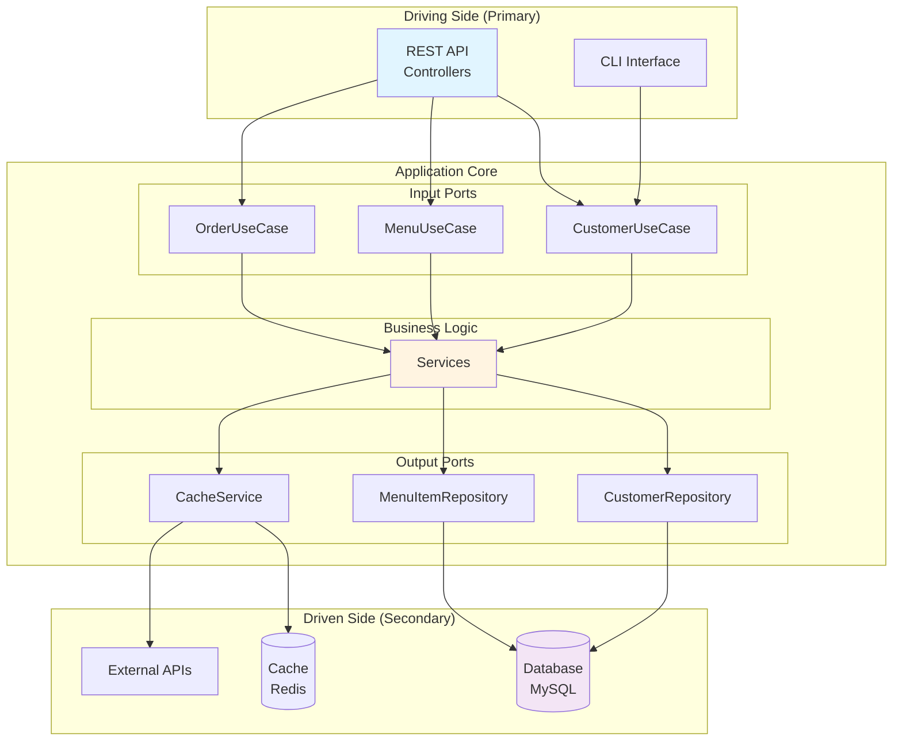
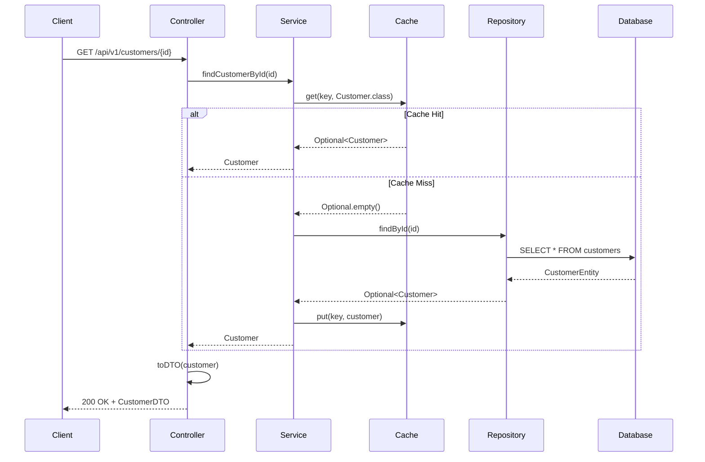
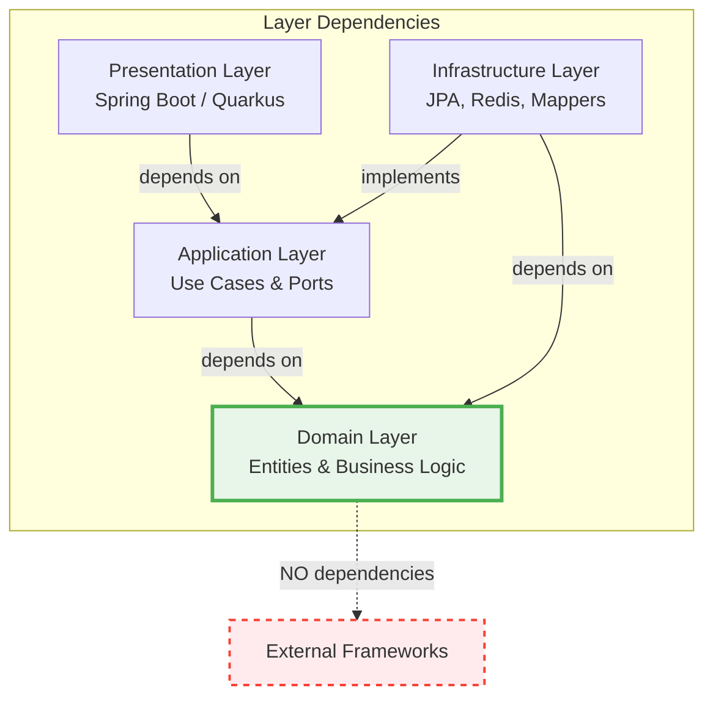
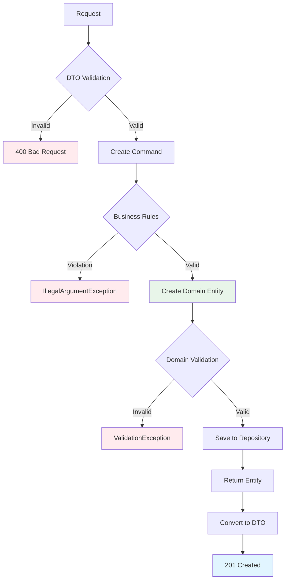
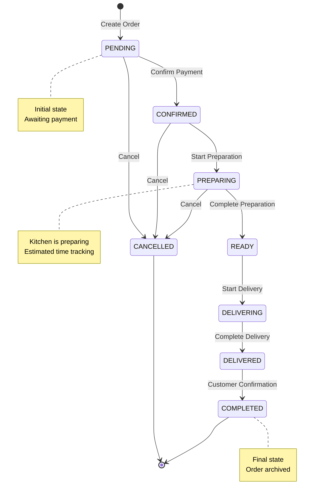
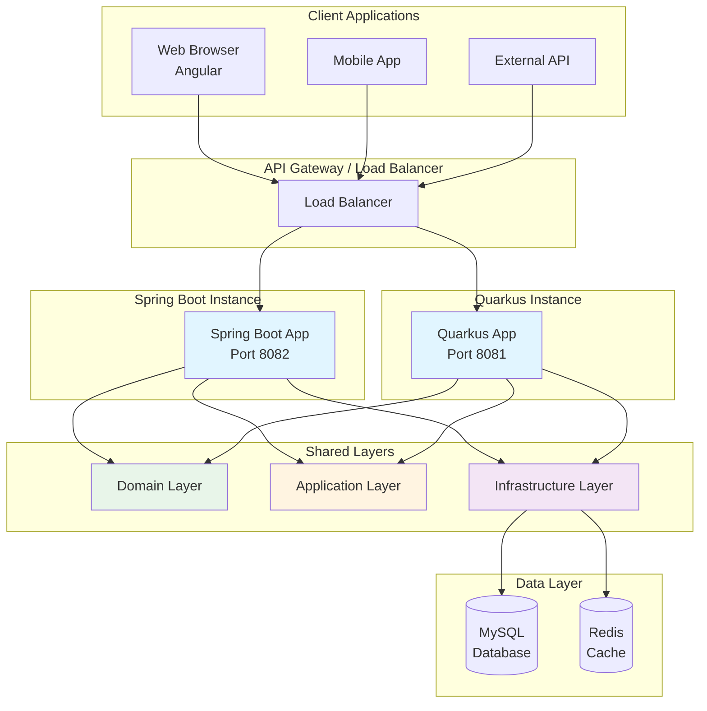
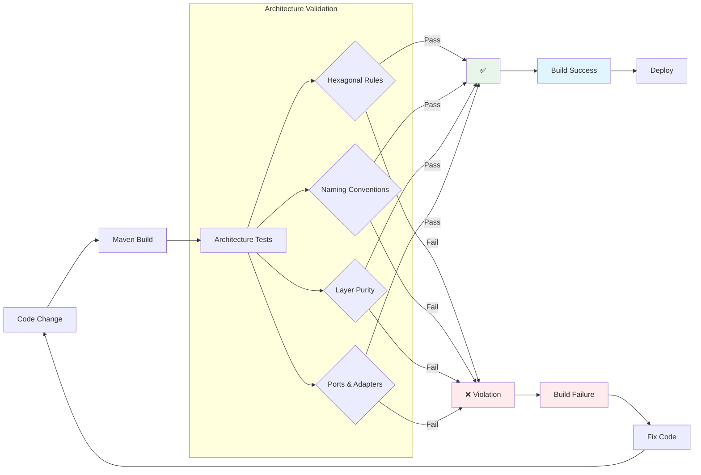

# 📊 Diagramas de Arquitetura - Restaurant Management System

## 🏗️ Arquitetura Hexagonal



## 🔄 Fluxo de Criação de Customer



## 📦 Estrutura de Pacotes



## 🎯 Padrão Ports & Adapters



## 🔀 Fluxo de Dados com Cache



## 🏛️ Camadas e Dependências



## 🔐 Fluxo de Validação



## 🔄 Ciclo de Vida do Pedido



## 🏢 Arquitetura Multi-Framework



## 📊 Fluxo de Testes de Arquitetura



## 🎨 Padrão DTO vs Domain

```mermaid
graph LR
    subgraph "Presentation Layer"
        DTO[CustomerDTO<br/>+ Jackson Annotations<br/>+ Validation<br/>+ Serialization]
    end
    
    subgraph "Mapper"
        MAP[CustomerDTOMapper<br/>toDTO()<br/>toDomain()]
    end
    
    subgraph "Domain Layer"
        DOM[Customer Entity<br/>+ Business Logic<br/>+ Pure Java<br/>- No Frameworks]
    end
    
    DTO <-->|Convert| MAP
    MAP <-->|Convert| DOM
    
    style DTO fill:#e1f5ff
    style DOM fill:#e8f5e9
    style MAP fill:#fff4e1
```

---

## 📚 Legenda de Cores

- 🟢 **Verde**: Domain Layer (Puro, sem frameworks)
- 🟡 **Amarelo**: Application Layer (Use Cases)
- 🟣 **Roxo**: Infrastructure Layer (Persistência)
- 🔵 **Azul**: Presentation Layer (Controllers/APIs)
- 🔴 **Vermelho**: Erros ou Violações

---

## 🔗 Links Relacionados

- [ARCHITECTURE.md](./ARCHITECTURE.md) - Documentação detalhada da arquitetura
- [ARCHITECTURE_TESTS_SUMMARY.md](./ARCHITECTURE_TESTS_SUMMARY.md) - Resumo dos testes
- [README.md](./README.md) - Guia principal do projeto
